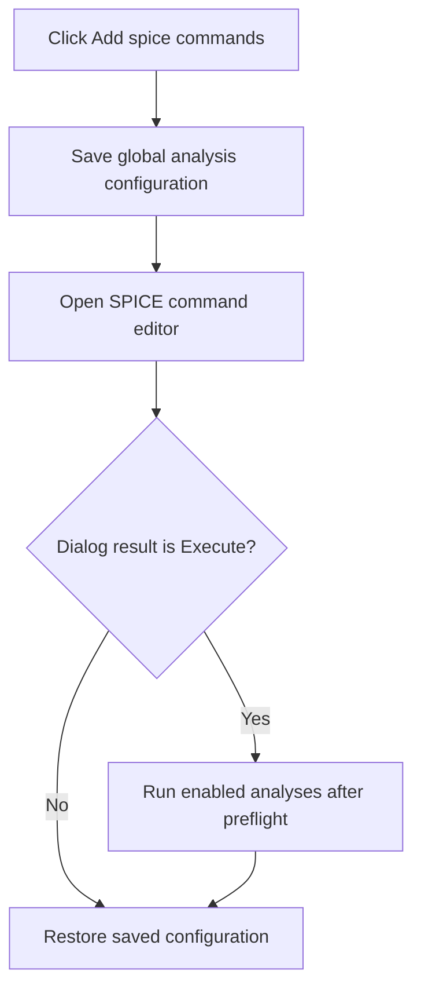

# Add spice commands...

> Analysis status: Reviewed from the command-editor, modal-result, and batch-dispatch paths.

## Control

| Property | Recovered value |
| --- | --- |
| Form | SchematicEditor |
| Component path | SchematicEditor.MainMenu.mnAnalysis.mnSpiceCommands |
| Control class | TMenuItem |
| Caption | Add spice commands... |
| Hint | Not present in the recovered resource. |
| Text | Not present in the recovered resource. |
| Handler name | mnSpiceCommandsClick |
| Handler address | 01c90510 |
| Graph node | `resource:dfm:SchematicEditor/SchematicEditor.MainMenu.mnAnalysis.mnSpiceCommands` |
| Handler node | `function:01c90510` |
| Graph layer | UI |

## What happens when clicked

The handler saves the current global analysis configuration and opens `SpiceCommandEditor` on the active schematic's command list. The dialog OK path stores nonempty command and value rows. If the dialog returns modal result 6 from Execute, the handler runs each enabled batch analysis in this order: Transient, AC Transfer, DC Transfer, and Noise. Each analysis runs only when its preflight succeeds. After the dialog path finishes, the handler restores the saved global configuration.

## Click flow

## Handler evidence

- Source: [DecompiledSources/Tina16/functions/0000000001C90510__FUN_01c90510.c](../../../DecompiledSources/Tina16/functions/0000000001C90510__FUN_01c90510.c)
- Recovered role: Edit schematic SPICE commands and optionally run enabled analyses.
- Current graph summary: Handles 1 Delphi UI event: SchematicEditor.MainMenu.mnAnalysis.mnSpiceCommands.OnClick.
- Current graph behavior: Binds the command editor to the active command list, dispatches enabled analyses only for Execute, and restores the prior global analysis configuration.
- Current graph evidence: `FUN_01c90510` copies the global configuration before it constructs `SpiceCommandEditor` through `FUN_014723c0`. It passes the active schematic command list at offset `+0x440`, compares the modal result with 6, calls the annotated dispatcher `FUN_01c92e80` only for that result, and copies the saved configuration back before return. The resource gives Execute modal result 6.
- Complexity: complex
- Distinct outgoing calls: 6

## Direct calls

- `function:00410f20` — Nil-safe Delphi object destruction helper
- `function:00417580` — FUN_00417580
- `function:00417740` — FUN_00417740
- `function:00417c40` — FUN_00417c40
- `function:014723c0` — FUN_014723c0
- `function:01c92e80` — FUN_01c92e80

## Resource evidence

- Kind: Not present in the recovered resource.
- Modal result: Not present in the recovered resource.
- Checked state: Not present in the recovered resource.
- List items: Not present in the recovered resource.
- Image reference: Not present in the recovered resource.
- Extracted glyph: None.

## Nearby label candidates

Nearby labels are layout candidates only. They are not proof of behavior.

- No same-parent label candidate is available.

## Analysis limits

- Analysis-specific errors are handled below `FUN_01c92e80`; this menu handler has no local error branch.

