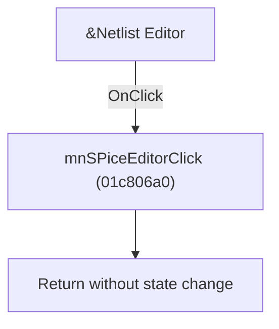

# &Netlist Editor

> Analysis status: Individually reviewed.

## Control

| Property | Recovered value |
| --- | --- |
| Form | SchematicEditor |
| Component path | SchematicEditor.MainMenu.mnTools.mnSPiceEditor |
| Control class | TMenuItem |
| Caption | &Netlist Editor |
| Hint | Not present in the recovered resource. |
| Text | Not present in the recovered resource. |
| Handler name | mnSPiceEditorClick |
| Handler address | 01c806a0 |
| Graph node | `resource:dfm:SchematicEditor/SchematicEditor.MainMenu.mnTools.mnSPiceEditor` |
| Handler node | `function:01c806a0` |
| Graph layer | UI |

## What happens when clicked

The recovered handler returns immediately without opening an editor or changing state.

## Click flow

## Handler evidence

- Source: [DecompiledSources/Tina16/functions/0000000001C806A0__FUN_01c806a0.c](../../../DecompiledSources/Tina16/functions/0000000001C806A0__FUN_01c806a0.c)
- Recovered role: No-op Netlist Editor handler.
- Current graph summary: Handles 1 Delphi UI event: SchematicEditor.MainMenu.mnTools.mnSPiceEditor.OnClick.
- Current graph behavior: The recovered handler returns immediately without opening an editor or changing state.
- Current graph evidence: FUN_01c806a0 contains only a return and has zero outgoing graph calls. The DFM binds the Netlist Editor menu item to it.
- Complexity: simple
- Distinct outgoing calls: 0

## Direct calls

- No direct call edge is present in the recovered graph.

## Resource evidence

- Kind: Not present in the recovered resource.
- Modal result: Not present in the recovered resource.
- Checked state: Not present in the recovered resource.
- List items: Not present in the recovered resource.
- Image reference: Not present in the recovered resource.
- Extracted glyph: None.

## Nearby label candidates

Nearby labels are layout candidates only. They are not proof of behavior.

- No same-parent label candidate is available.

## Analysis limits

- Another action path can expose the netlist editor, but this handler does not.

