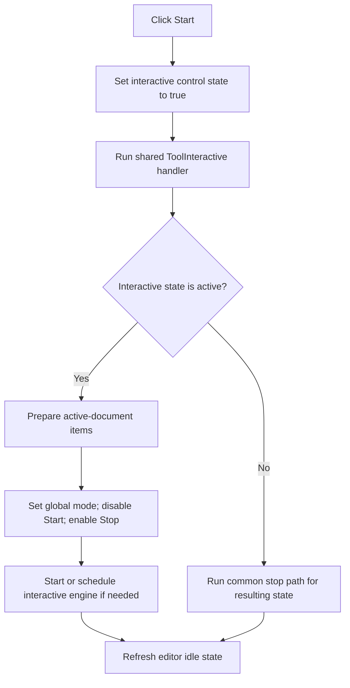

# Start

> Analysis status: Reviewed from recovered state assignment and the shared interactive-mode handler.

## Control

| Property | Recovered value |
| --- | --- |
| Form | SchematicEditor |
| Component path | SchematicEditor.MainMenu.mnInteractive.mnStartInteractive |
| Control class | TMenuItem |
| Caption | Start |
| Hint | Not present in the recovered resource. |
| Text | Not present in the recovered resource. |
| Handler name | mnStartInteractiveClick |
| Handler address | 01c99750 |
| Graph node | `resource:dfm:SchematicEditor/SchematicEditor.MainMenu.mnInteractive.mnStartInteractive` |
| Handler node | `function:01c99750` |
| Graph layer | UI |

## What happens when clicked

The handler sets the shared interactive control state to true and then calls the same worker as `SchematicEditor.TopToolBar.EditorTools.ToolInteractive`. The shared worker reads that state, prepares each item in the active document for interactive operation when the global interactive subsystem is not already active, sets the global interactive flag, disables the Start menu item, enables the Stop item, and starts or schedules the interactive engine when the editor is not already running it.

It finishes by running the editor idle-state refresh. If the shared state setter rejects an unavailable or unchanged transition, its setter can be a no-op; the common worker still evaluates the resulting state.

## Click flow

## Handler evidence

- Source: [DecompiledSources/Tina16/functions/0000000001C99750__FUN_01c99750.c](../../../DecompiledSources/Tina16/functions/0000000001C99750__FUN_01c99750.c)
- Recovered role: Select and start the Schematic Editor interactive mode.
- Current graph summary: Handles 1 Delphi UI event: SchematicEditor.MainMenu.mnInteractive.mnStartInteractive.OnClick.
- Current graph behavior: Forces the shared interactive state on and invokes the toolbar's recovered interaction transition path.
- Current graph evidence: `FUN_01c99750` passes 1 to `FUN_0082a6c0` for field `+0xd08` and then calls `FUN_01c87e40`. The latter tests that field at `+0x328`, prepares document items, writes the global mode flag, and updates the Start and Stop menu enabled states.
- Complexity: moderate
- Distinct outgoing calls: 2

## Direct calls

- `function:0082a6c0` — FUN_0082a6c0
- `function:01c87e40` — Handles 1 Delphi UI event: SchematicEditor.TopToolBar.EditorTools.ToolInteractive.OnClick.

## Resource evidence

- Kind: Not present in the recovered resource.
- Modal result: Not present in the recovered resource.
- Checked state: Not present in the recovered resource.
- List items: Not present in the recovered resource.
- Image reference: Not present in the recovered resource.
- Extracted glyph: None.

## Nearby label candidates

Nearby labels are layout candidates only. They are not proof of behavior.

- No same-parent label candidate is available.

## Analysis limits

- The original Delphi class and property name for the control at form offset `+0xd08` are not recovered.
- The engine start can be deferred through a callback; this handler does not expose its scheduling policy.

