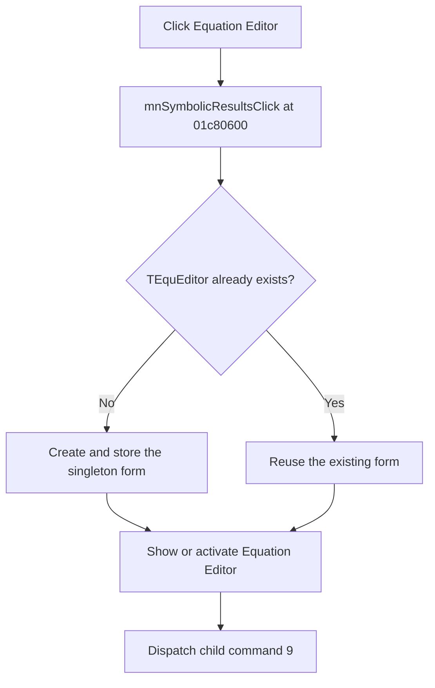

# &Equation Editor

> Analysis status: Complete.

## Control

| Property | Recovered value |
| --- | --- |
| Form | SchematicEditor |
| Component path | SchematicEditor.MainMenu.mnTools.mnSymbolicResults |
| Control class | TMenuItem |
| Caption | &Equation Editor |
| Handler | `mnSymbolicResultsClick` at `01c80600` |
| Graph nodes | `resource:dfm:SchematicEditor/SchematicEditor.MainMenu.mnTools.mnSymbolicResults` → `function:01c80600` |
| Graph layer | UI |

## What happens when clicked

The handler calls `FUN_0145e620`. That helper searches the application form list for the `TEquEditor` class, creates the singleton when it is absent, stores the global reference, and shows or activates the Equation Editor.

The handler then obtains the Equation Editor child object at offset `+0x468` and invokes its recovered dispatch path with numeric command `9`. The target method name is not recovered. The form is still created and shown before this dispatch.

There is no local message, retry, or exception handler. If the Equation Editor already exists, the helper reuses and activates it.

## Click flow

## Evidence

- Handler: [FUN_01c80600](../../../DecompiledSources/Tina16/functions/0000000001C80600__FUN_01c80600.c)
- Singleton show path: [FUN_0145e620](../../../DecompiledSources/Tina16/functions/000000000145E620__FUN_0145e620.c)
- Form lookup and creation: [FUN_0145e590](../../../DecompiledSources/Tina16/functions/000000000145E590__FUN_0145e590.c)
- Child lookup: [FUN_0065b870](../../../DecompiledSources/Tina16/functions/000000000065B870__FUN_0065b870.c)
- Recovered role: Show the singleton Equation Editor and select its command path `9`.
- No image or glyph is present for this menu item.

## Analysis limits

- The indirect command-`9` method does not have a recovered target. Its more specific tab or action name remains unknown.
