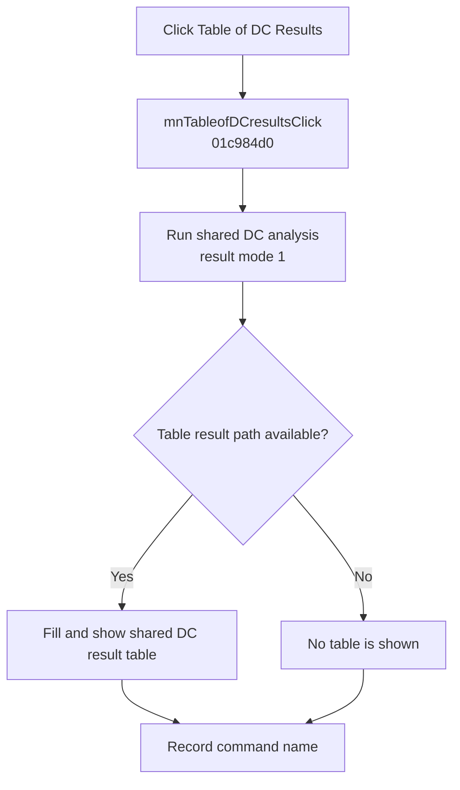

# Table of DC results

> Analysis status: Complete. The handler selects the table result mode of the shared DC analysis path.

## Control

| Property | Recovered value |
| --- | --- |
| Form | SchematicEditor |
| Component path | SchematicEditor.MainMenu.mnAnalysis.DCAnalysis.mnTableofDCresults |
| Control class | TMenuItem |
| Caption | Table of DC results |
| Hint | Not present in the recovered resource. |
| Text | Not present in the recovered resource. |
| Handler name | mnTableofDCresultsClick |
| Handler address | 01c984d0 |
| Graph node | `resource:dfm:SchematicEditor/SchematicEditor.MainMenu.mnAnalysis.DCAnalysis.mnTableofDCresults` |
| Handler node | `function:01c984d0` |
| Graph layer | UI |

## What happens when clicked

`FUN_01c984d0` passes the active schematic model to `FUN_01320bb0` with the recovered DC selector and result-display mode `1`. The shared routine builds and runs the DC analysis. Its mode-1 result path calls `FUN_012b86e0`, which creates or reuses the shared result form, selects the table caption resource, fills the form from the analysis object, activates the matching editor command, and shows the form.

After the shared routine returns, the handler records `mnTableofDCresultsClick`. It does not inspect the analysis return value.

## Click flow

## Handler evidence

- Source: [DecompiledSources/Tina16/functions/0000000001C984D0__FUN_01c984d0.c](../../../DecompiledSources/Tina16/functions/0000000001C984D0__FUN_01c984d0.c)
- Recovered role: Runs the shared DC analysis and requests its table result view.
- Current graph summary: Handles 1 Delphi UI event: SchematicEditor.MainMenu.mnAnalysis.DCAnalysis.mnTableofDCresults.OnClick.
- Current graph behavior: Calls the shared DC analysis with result mode 1, lets it fill and show the DC result table when available, and then records the command name.
- Current graph evidence: `FUN_01c984d0` differs from the operating-point wrapper by passing argument 4 as 1 to `FUN_01320bb0`. The shared routine forwards that mode to `FUN_0131f8d0`; its nonzero branch calls `FUN_012b86e0`, which fills, activates, and shows the shared result form.
- Complexity: moderate
- Distinct outgoing calls: 2

## Direct calls

- `function:00414ad0` — Records the command name
- `function:01320bb0` — Builds and runs the DC analysis and selects the table result path

## Resource evidence

- Kind: Not present in the recovered resource.
- Modal result: Not present in the recovered resource.
- Checked state: Not present in the recovered resource.
- List items: Not present in the recovered resource.
- Image reference: Not present in the recovered resource.
- Extracted glyph: None.

## Nearby label candidates

Nearby labels are layout candidates only. They are not proof of behavior.

- No same-parent label candidate is available.

## Analysis limits

- The handler does not expose the meanings of internal solver return states.
- Analysis exceptions and cleanup are owned by the shared routine; the wrapper has no local recovery.
