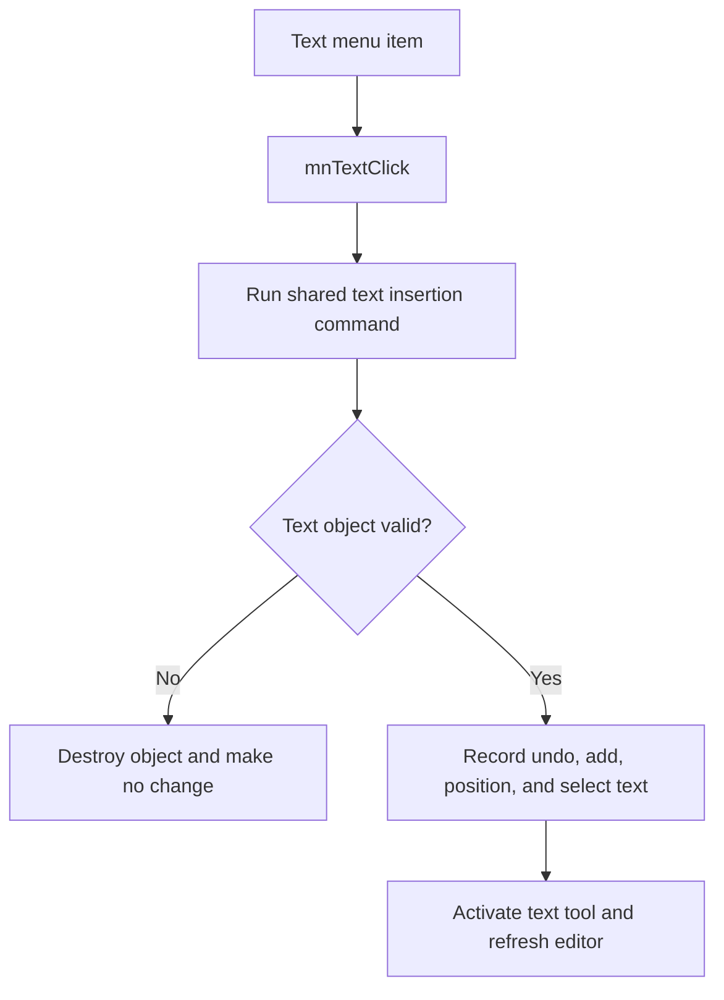

# &Text

> Analysis status: Reviewed with recovered validation, undo, and placement evidence.

## Control

| Property | Recovered value |
| --- | --- |
| Component path | `SchematicEditor.MainMenu.Insert.mnText` |
| Control class | `TMenuItem` |
| Handler | `mnTextClick` at `01c77460` |

## What happens when clicked

The menu handler delegates to the same text command as the editor text tool. The command stops when insertion is blocked. It constructs and validates a text object. Failed validation destroys the temporary object and clears placement state. A valid object gets undo data, is added at the current insertion coordinates, becomes the only selected object, activates the text tool, and refreshes the editor.

## Click flow

## Evidence

- [Menu handler](../../../DecompiledSources/Tina16/functions/0000000001C77460__FUN_01c77460.c) delegates directly to the shared text command.
- [Text command](../../../DecompiledSources/Tina16/functions/0000000001C6D750__FUN_01c6d750.c) contains the guard, validation, cleanup, undo, add, position, selection, and refresh paths.
- The same command is bound to `SchematicEditor.TopToolBar.EditorTools.ToolText` in the UI evidence view.

## Analysis limits

- The recovered symbols do not expose the initial text string.
