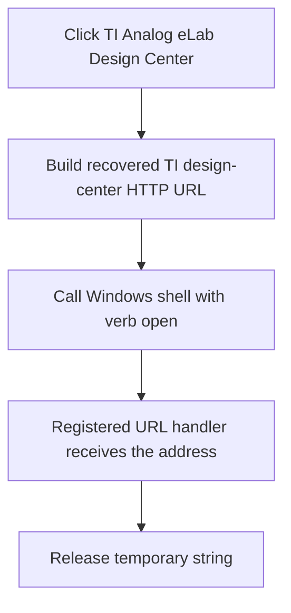

# TI Analog eLab Design Center

> Analysis status: Reviewed from the recovered URL and Windows shell invocation.

## Control

| Property | Recovered value |
| --- | --- |
| Form | SchematicEditor |
| Component path | SchematicEditor.MainMenu.mnTIUtilities.mnTIAnalogeLabDesignTools |
| Control class | TMenuItem |
| Caption | TI Analog eLab Design Center |
| Hint | Not present in the recovered resource. |
| Text | Not present in the recovered resource. |
| Handler name | mnTIAnalogeLabDesignToolsClick |
| Handler address | 01c9d240 |
| Graph node | `resource:dfm:SchematicEditor/SchematicEditor.MainMenu.mnTIUtilities.mnTIAnalogeLabDesignTools` |
| Handler node | `function:01c9d240` |
| Graph layer | UI |

## What happens when clicked

The handler constructs the exact legacy HTTP URL `http://focus.ti.com/adc/docs/portal.tsp?sectionId=121&contentId=23493&DCMP=hpa_design_center&HQS=Tools+OT+analogdesigncenter`. It passes that URL to the Windows shell with the verb `open` and show mode 1. Windows opens it through the registered URL handler, normally the default browser. The handler then releases its temporary string.

It does not inspect the shell return value and does not show a local browser-launch error.

## Click flow

## Handler evidence

- Source: [DecompiledSources/Tina16/functions/0000000001C9D240__FUN_01c9d240.c](../../../DecompiledSources/Tina16/functions/0000000001C9D240__FUN_01c9d240.c)
- Recovered role: Open the TI Analog eLab Design Center URL through the Windows shell.
- Current graph summary: Handles 1 Delphi UI event: SchematicEditor.MainMenu.mnTIUtilities.mnTIAnalogeLabDesignTools.OnClick.
- Current graph behavior: Opens the literal TI Analog eLab URL with the registered Windows URL handler.
- Current graph evidence: `FUN_01c9d240` contains the complete HTTP URL and calls the recovered `ShellExecuteW` thunk with `open`, no parameters, no working directory, and show mode 1.
- Complexity: complex
- Distinct outgoing calls: 3

## Direct calls

- `function:00414480` — Delphi UnicodeString clear and finalization helper
- `function:00414b50` — FUN_00414b50
- `function:00416740` — FUN_00416740

## Resource evidence

- Kind: Not present in the recovered resource.
- Modal result: Not present in the recovered resource.
- Checked state: Not present in the recovered resource.
- List items: Not present in the recovered resource.
- Image reference: Not present in the recovered resource.
- Extracted glyph: None.

## Nearby label candidates

Nearby labels are layout candidates only. They are not proof of behavior.

- No same-parent label candidate is available.

## Analysis limits

- This legacy URL can redirect or stop working outside the recovered program. The static source proves only the address passed to Windows.
- The handler ignores the `ShellExecuteW` result.

