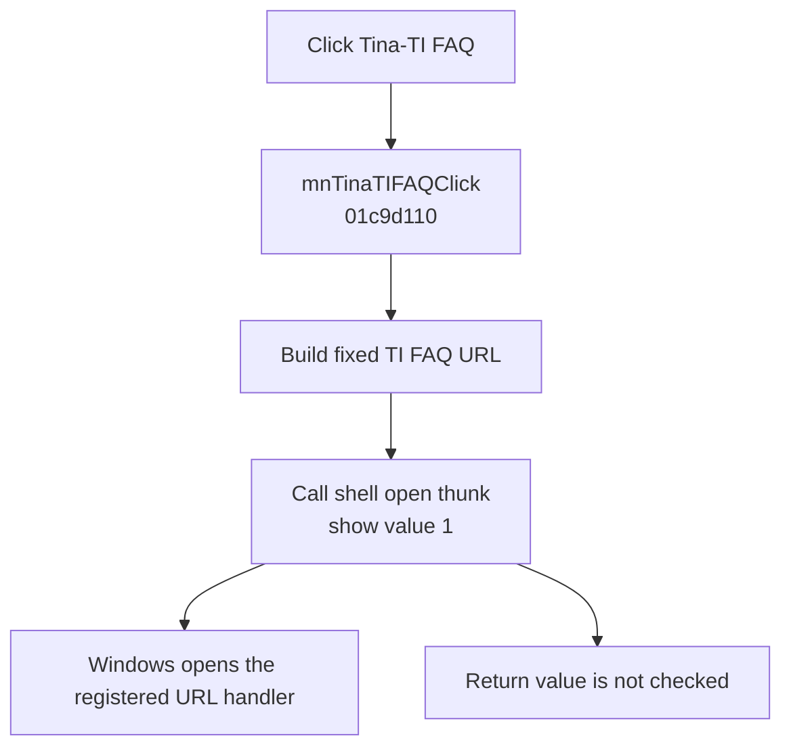

# Tina-TI FAQ

> Analysis status: Evidence-backed source review complete.

## Control

| Property | Recovered value |
| --- | --- |
| Form | SchematicEditor |
| Component path | SchematicEditor.MainMenu.mnTIUtilities.mnTinaTIFAQ |
| Control class | TMenuItem |
| Caption | Tina-TI FAQ |
| Hint | Not present in the recovered resource. |
| Text | Not present in the recovered resource. |
| Handler name | mnTinaTIFAQClick |
| Handler address | 01c9d110 |
| Graph node | `resource:dfm:SchematicEditor/SchematicEditor.MainMenu.mnTIUtilities.mnTinaTIFAQ` |
| Handler node | `function:01c9d110` |
| Graph layer | UI |

## What happens when clicked

`mnTinaTIFAQClick` creates the fixed URL `http://focus.ti.com/analog/docs/gencontent.tsp?familyId=02&genContentId=33361`. It converts the Delphi string to a pointer and calls the recovered shell thunk with verb `open`, no parameters, no working directory, and show value `1`. This call has the `ShellExecuteW` argument layout and asks Windows to open the URL with its registered handler.

The handler does not check the shell call's return value and does not show a local error if Windows cannot open the address. It clears the temporary Delphi string before it returns. The URL is an old fixed TI support address; the recovered source does not contain a fallback address.

## Click flow

## Handler evidence

- Source: [DecompiledSources/Tina16/functions/0000000001C9D110__FUN_01c9d110.c](../../../DecompiledSources/Tina16/functions/0000000001C9D110__FUN_01c9d110.c)
- Recovered role: Open the fixed Tina-TI FAQ URL through the Windows shell.
- Current graph summary: Handles 1 Delphi UI event: SchematicEditor.MainMenu.mnTIUtilities.mnTinaTIFAQ.OnClick.
- Current graph behavior: Builds one fixed HTTP URL and asks the Windows shell to open it with the registered handler.
- Current graph evidence: The DFM binds the FAQ item to `mnTinaTIFAQClick`. The handler body contains the complete URL and a shell call with `ShellExecuteW` argument order, including verb `open` and show value `1`.
- Complexity: complex
- Distinct outgoing calls: 3

## Direct calls

- `function:00414480` — Delphi UnicodeString clear and finalization helper
- `function:00414b50` — FUN_00414b50
- `function:00416740` — FUN_00416740
- Recovered shell thunk [`thunk_FUN_0419adcc`](../../../DecompiledSources/Tina16/functions/0000000000636960__thunk_FUN_0419adcc.c) — dispatches the shell-open request through the import table.

## Resource evidence

- Kind: Not present in the recovered resource.
- Modal result: Not present in the recovered resource.
- Checked state: Not present in the recovered resource.
- List items: Not present in the recovered resource.
- Image reference: Not present in the recovered resource.
- Extracted glyph: None.

## Nearby label candidates

Nearby labels are layout candidates only. They are not proof of behavior.

- No same-parent label candidate is available.

## Analysis limits

- The shell import does not retain its API name in the recovered symbol. Its arguments match `ShellExecuteW`; this API identity is an evidence-based inference.
- The current availability or redirect behavior of the fixed external URL is outside the recovered program evidence.

