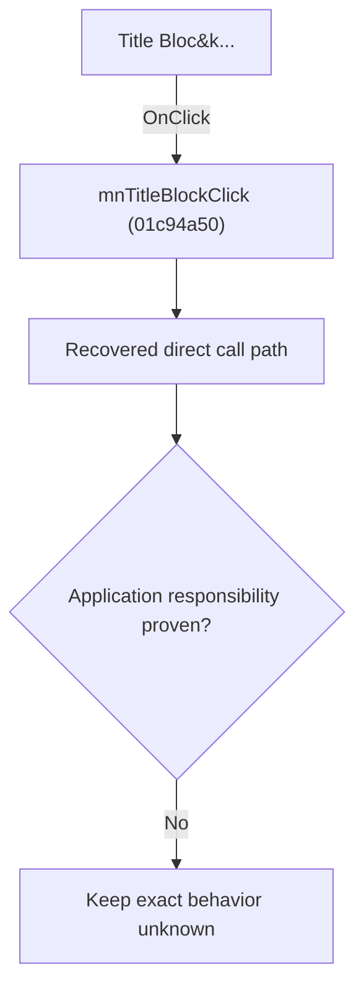

# Title Bloc&k...

> Analysis status: Blocked by an exact evidence gap.

## Control

| Property | Recovered value |
| --- | --- |
| Form | SchematicEditor |
| Component path | SchematicEditor.MainMenu.Insert.mnTitleBlock |
| Control class | TMenuItem |
| Caption | Title Bloc&k... |
| Hint | Not present in the recovered resource. |
| Text | Not present in the recovered resource. |
| Handler name | mnTitleBlockClick |
| Handler address | 01c94a50 |
| Graph node | `resource:dfm:SchematicEditor/SchematicEditor.MainMenu.Insert.mnTitleBlock` |
| Handler node | `function:01c94a50` |
| Graph layer | UI |

## What happens when clicked

The OnClick binding reaches mnTitleBlockClick at 01c94a50. The recovered body has 11 distinct outgoing graph call(s), but the application-specific responsibilities and data effects of its downstream path are not established in the accepted graph evidence. The control's caption or name indicates user intent only; it is not enough to claim implementation behavior.

## Click flow

## Handler evidence

- Source: [DecompiledSources/Tina16/functions/0000000001C94A50__FUN_01c94a50.c](../../../DecompiledSources/Tina16/functions/0000000001C94A50__FUN_01c94a50.c)
- Recovered role: Evidence-blocked mnTitleBlockClick command.
- Current graph summary: Handles 1 Delphi UI event: SchematicEditor.MainMenu.Insert.mnTitleBlock.OnClick.
- Current graph behavior: The OnClick binding reaches mnTitleBlockClick at 01c94a50. The recovered body has 11 distinct outgoing graph call(s), but the application-specific responsibilities and data effects of its downstream path are not established in the accepted graph evidence. The control's caption or name indicates user intent only; it is not enough to claim implementation behavior.
- Current graph evidence: The DFM binds SchematicEditor.MainMenu.Insert.mnTitleBlock to mnTitleBlockClick. The recovered source is DecompiledSources/Tina16/functions/0000000001C94A50__FUN_01c94a50.c and directly references 00410f20, 00414480, 004b6930, 00724270, 010bb2c0, 010bc210, 0198d430, 01993f30, and 3 more. No accepted end-to-end role was established for this control path.
- Complexity: complex
- Distinct outgoing calls: 11

## Direct calls

- `function:00410f20` — Nil-safe Delphi object destruction helper
- `function:00414480` — Delphi UnicodeString clear and finalization helper
- `function:004b6930` — FUN_004b6930
- `function:00724270` — FUN_00724270
- `function:010bb2c0` — FUN_010bb2c0
- `function:010bc210` — FUN_010bc210
- `function:0198d430` — FUN_0198d430
- `function:01993f30` — FUN_01993f30
- `function:01994230` — FUN_01994230
- `function:0199e310` — FUN_0199e310
- `function:019ab9a0` — FUN_019ab9a0

## Resource evidence

- Kind: Not present in the recovered resource.
- Modal result: Not present in the recovered resource.
- Checked state: Not present in the recovered resource.
- List items: Not present in the recovered resource.
- Image reference: Not present in the recovered resource.
- Extracted glyph: None.

## Nearby label candidates

Nearby labels are layout candidates only. They are not proof of behavior.

- No same-parent label candidate is available.

## Analysis limits

- Exact gap: the recovered handler or one of its direct application callees lacks a source-supported role that proves the command's decisions, state changes, and output. Keep this Bead open until those callees are traced.

