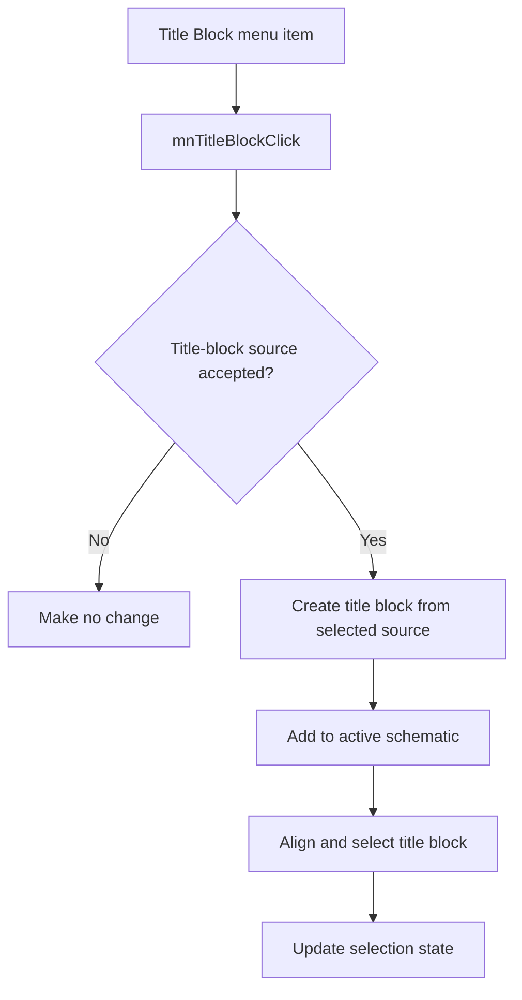

# Title Bloc&k...

> Analysis status: Reviewed with recovered file-selection and insertion evidence.

## Control

| Property | Recovered value |
| --- | --- |
| Component path | `SchematicEditor.MainMenu.Insert.mnTitleBlock` |
| Control class | `TMenuItem` |
| Handler | `mnTitleBlockClick` at `01c94a50` |

## What happens when clicked

The command makes no change when the title-block source is not accepted. After acceptance, it reads the selected source path, creates a title-block object with that source, and adds it to the active schematic. It clears the previous selection, aligns the new object to the current page bounds, selects it, runs its update methods, and refreshes the selection state.

## Click flow

## Evidence

- [Handler source](../../../DecompiledSources/Tina16/functions/0000000001C94A50__FUN_01c94a50.c) reads the selected path and performs the add, selection, alignment, and update sequence.
- [Title-block constructor](../../../DecompiledSources/Tina16/functions/00000000010BB2C0__FUN_010bb2c0.c) loads the supplied title-block source, or the default `TitleBlk_WB.tbt` when no source is supplied.
- [Alignment helper](../../../DecompiledSources/Tina16/functions/00000000010BC210__FUN_010bc210.c) positions the object from its alignment mode and page bounds.

## Analysis limits

- The recovered file-selection control has no Delphi field name.
