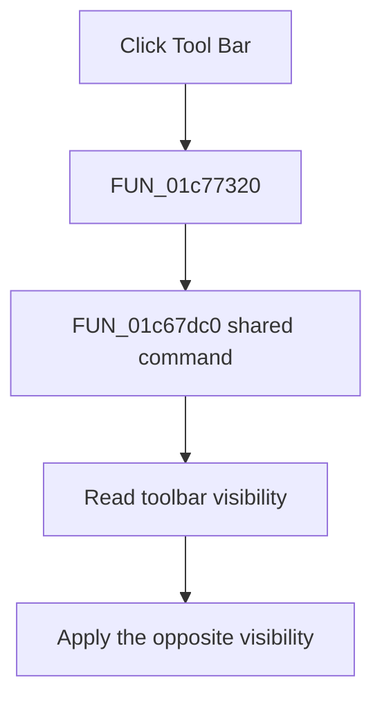

# &Tool Bar

> Analysis status: Complete. The shared Tool Bar command and VCL visibility state establish the toggle.

## Control

| Property | Recovered value |
| --- | --- |
| Form | SchematicEditor |
| Component path | SchematicEditor.MainMenu.View.mnToolBar |
| Control class | TMenuItem |
| Caption | &Tool Bar |
| Hint | Not present in the recovered resource. |
| Text | Not present in the recovered resource. |
| Handler name | mnToolBarClick |
| Handler address | 01c77320 |
| Graph node | `resource:dfm:SchematicEditor/SchematicEditor.MainMenu.View.mnToolBar` |
| Handler node | `function:01c77320` |
| Graph layer | UI |

## What happens when clicked

`FUN_01c77320` delegates to `FUN_01c67dc0`. The helper reads the Visible byte of the main toolbar at form offset `0x6C8`, inverts it, and applies the result with the VCL visibility setter. `SchematicEditor.ToolsPopup.ToolBar` uses the same helper. Thus, the View menu item and popup item are two entry points that show or hide the main toolbar.

## Click flow

## Handler evidence

- Source: [DecompiledSources/Tina16/functions/0000000001C77320__FUN_01c77320.c](../../../DecompiledSources/Tina16/functions/0000000001C77320__FUN_01c77320.c)
- Recovered role: Toggles visibility of the main schematic-editor toolbar.
- Current graph summary: Handles 1 Delphi UI event: SchematicEditor.MainMenu.View.mnToolBar.OnClick.
- Current graph behavior: Calls the shared Tool Bar command, which inverts the main toolbar's Visible state.
- Current graph evidence: The wrapper calls `FUN_01c67dc0`. The helper reads Visible byte `0xA9` from form field `0x6C8` and passes its inverse to `FUN_0064dbe0`. The `ToolsPopup.ToolBar` control uses the same helper and has the same caption.
- Complexity: simple
- Distinct outgoing calls: 1

## Direct calls

- `function:01c67dc0` — Handles 1 Delphi UI event: SchematicEditor.ToolsPopup.ToolBar.OnClick.

## Resource evidence

- Kind: Not present in the recovered resource.
- Modal result: Not present in the recovered resource.
- Checked state: true
- List items: Not present in the recovered resource.
- Image reference: Not present in the recovered resource.
- Extracted glyph: None.

## Nearby label candidates

Nearby labels are layout candidates only. They are not proof of behavior.

- No same-parent label candidate is available.

## Analysis limits

- The toolbar field at offset `0x6C8` has no recovered Delphi name.

