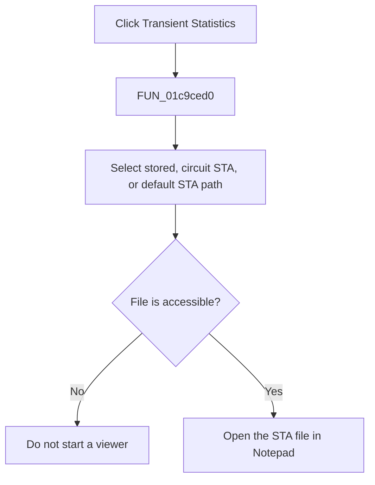

# Transient &Statistics

> Analysis status: Complete. The file-selection branches and ShellExecute wrapper establish the command.

## Control

| Property | Recovered value |
| --- | --- |
| Form | SchematicEditor |
| Component path | SchematicEditor.MainMenu.View.mnTransientStatistics |
| Control class | TMenuItem |
| Caption | Transient &Statistics |
| Hint | Not present in the recovered resource. |
| Text | Not present in the recovered resource. |
| Handler name | mnTransientStatisticsClick |
| Handler address | 01c9ced0 |
| Graph node | `resource:dfm:SchematicEditor/SchematicEditor.MainMenu.View.mnTransientStatistics` |
| Handler node | `function:01c9ced0` |
| Graph layer | UI |

## What happens when clicked

`FUN_01c9ced0` selects a transient-statistics file. It first uses a stored statistics path when one is available. Otherwise, it derives a `.STA` path from the active circuit name or uses `Transient Statistics.STA`. It tests the selected path with `FUN_00440a20`. If the file is accessible, `FUN_01d44af0` opens `Notepad.exe` with that file through the recovered ShellExecute path. If the path test fails, the handler does not start Notepad and shows no error in this wrapper.

## Click flow

## Handler evidence

- Source: [DecompiledSources/Tina16/functions/0000000001C9CED0__FUN_01c9ced0.c](../../../DecompiledSources/Tina16/functions/0000000001C9CED0__FUN_01c9ced0.c)
- Recovered role: Selects the transient-statistics file and opens it in Notepad when accessible.
- Current graph summary: Handles 1 Delphi UI event: SchematicEditor.MainMenu.View.mnTransientStatistics.OnClick.
- Current graph behavior: Builds or retrieves a `.STA` statistics path, checks access, and opens the file with Notepad only when the check succeeds.
- Current graph evidence: The recovered handler contains the literal `Transient Statistics.STA`, derives a `.STA` extension from active-circuit state, calls `FUN_00440a20(path, 1)`, and calls `FUN_01d44af0(L"Notepad.exe", path, 1)` only on a true result. `FUN_01d44af0` reaches the ShellExecute import with verb `open`.
- Complexity: complex
- Distinct outgoing calls: 8

## Direct calls

- `function:00414480` — Delphi UnicodeString clear and finalization helper
- `function:00414560` — Delphi UnicodeString array finalization helper
- `function:00414b50` — FUN_00414b50
- `function:00416cd0` — FUN_00416cd0
- `function:00440a20` — FUN_00440a20
- `function:004414c0` — FUN_004414c0
- `function:00441920` — FUN_00441920
- `function:01d44af0` — FUN_01d44af0

## Resource evidence

- Kind: Not present in the recovered resource.
- Modal result: Not present in the recovered resource.
- Checked state: Not present in the recovered resource.
- List items: Not present in the recovered resource.
- Image reference: Not present in the recovered resource.
- Extracted glyph: None.

## Nearby label candidates

Nearby labels are layout candidates only. They are not proof of behavior.

- No same-parent label candidate is available.

## Analysis limits

- The global stored-path fields have no recovered Delphi names. The wrapper does not explain why a file-access check fails.

