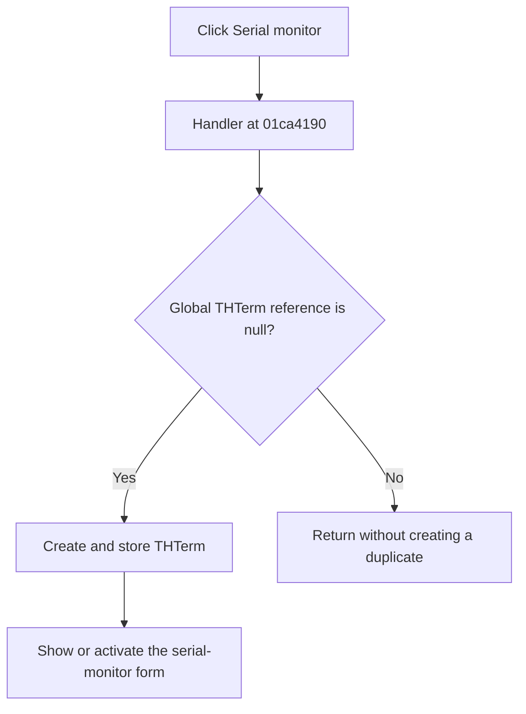

# Serial monitor

> Analysis status: Complete.

## Control

| Property | Recovered value |
| --- | --- |
| Form | SchematicEditor |
| Component path | SchematicEditor.MainMenu.mnTools.mnUARTTerminalWindow |
| Control class | TMenuItem |
| Caption | Serial monitor |
| Handler | `mnUARTTerminalWindowClick` at `01ca4190` |
| Graph nodes | `resource:dfm:SchematicEditor/SchematicEditor.MainMenu.mnTools.mnUARTTerminalWindow` → `function:01ca4190` |
| Graph layer | UI |

## What happens when clicked

The handler reads the global `THTerm` serial-monitor form reference. When the reference is null, it creates the form through class VMT `014b90e8`, stores the new object in the global field, and shows or activates it through `TCustomForm.Show`.

When the global reference is already non-null, this handler returns without another call. It does not create a duplicate form and does not explicitly reactivate the existing instance on this path.

The handler has no local message, fallback, or exception block.

## Click flow

## Evidence

- Handler: [FUN_01ca4190](../../../DecompiledSources/Tina16/functions/0000000001CA4190__FUN_01ca4190.c)
- VCL show path: [FUN_008059a0](../../../DecompiledSources/Tina16/functions/00000000008059A0__FUN_008059a0.c)
- Nearby recovered form handlers identify class `THTerm` in the `014ba1a0` to `014ba580` range.
- Recovered role: Create and show the singleton serial-monitor form.
- No image or glyph is present for this menu item.

## Analysis limits

- The Delphi name of the global form variable is not recovered.
