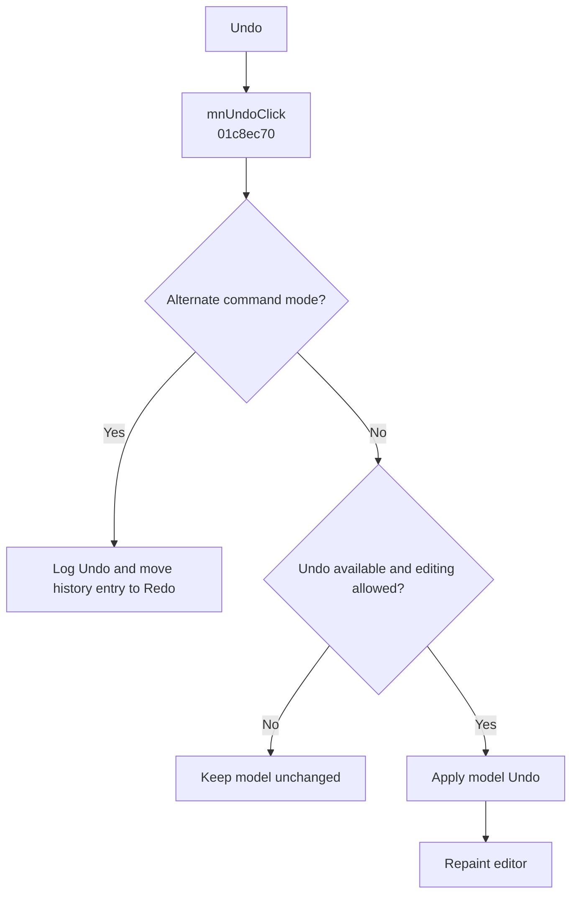

# &Undo

> Analysis status: Evidence-backed behavior recovered.

## Control

| Property | Recovered value |
| --- | --- |
| Form | SchematicEditor |
| Component path | SchematicEditor.MainMenu.Edit.mnUndo |
| Control class | TMenuItem |
| Caption | &Undo |
| Hint | Not present in the recovered resource. |
| Text | Not present in the recovered resource. |
| Handler name | mnUndoClick |
| Handler address | 01c8ec70 |
| Graph node | `resource:dfm:SchematicEditor/SchematicEditor.MainMenu.Edit.mnUndo` |
| Handler node | `function:01c8ec70` |
| Graph layer | UI |

## What happens when clicked

The normal branch runs only when the shared edit guard permits it, the model reports that Undo is available, form field `0x17F4` is zero, and byte `0x27C1` is zero. It then calls the model history executor with direction value 1 and repaints the editor. In the alternate command mode, it logs the literal `Undo()` and calls `FUN_0135B680`, which removes the current entry from the Undo queue, moves it to the Redo queue, and applies it to the model. Failed availability or guard checks are a no-op.

## Click flow

## Handler evidence

- Source: [DecompiledSources/Tina16/functions/0000000001C8EC70__FUN_01c8ec70.c](../../../DecompiledSources/Tina16/functions/0000000001C8EC70__FUN_01c8ec70.c)
- Recovered role: Applies one Undo operation through the active history implementation.
- Current graph summary: Handles 1 Delphi UI event: SchematicEditor.MainMenu.Edit.mnUndo.OnClick.
- Current graph behavior: The normal path tests model Undo availability and executes direction 1; the alternate path logs `Undo()` and transfers a history entry to the Redo queue.
- Current graph evidence: `FUN_019A4E30` checks the Undo index and global guards. `FUN_019A4EC0(..., 1)` executes the history entry. `FUN_0135B680` removes from one queue, inserts into the other, and applies the entry.
- Complexity: complex
- Distinct outgoing calls: 6

## Direct calls

- `function:0064e770` — FUN_0064e770
- `function:0135b680` — FUN_0135b680
- `function:017fe450` — FUN_017fe450
- `function:019a4e30` — FUN_019a4e30
- `function:019a4ec0` — FUN_019a4ec0
- `function:01c8cee0` — FUN_01c8cee0

## Resource evidence

- Kind: Not present in the recovered resource.
- Modal result: Not present in the recovered resource.
- Checked state: Not present in the recovered resource.
- List items: Not present in the recovered resource.
- Image reference: Not present in the recovered resource.
- Extracted glyph: None.

## Nearby label candidates

Nearby labels are layout candidates only. They are not proof of behavior.

- No same-parent label candidate is available.

## Analysis limits

- The semantic content of a history entry depends on the preceding edit and is not fixed by this command.

