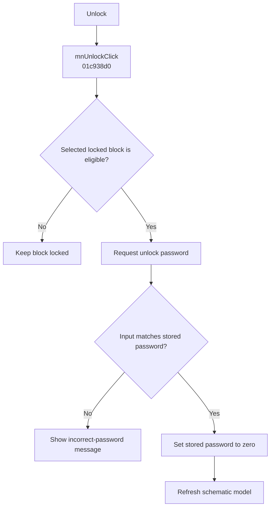

# Unlock...

> Analysis status: Evidence-backed behavior recovered.

## Control

| Property | Recovered value |
| --- | --- |
| Form | SchematicEditor |
| Component path | SchematicEditor.MainMenu.Edit.Sharing1.mnUnlock |
| Control class | TMenuItem |
| Caption | Unlock... |
| Hint | Not present in the recovered resource. |
| Text | Not present in the recovered resource. |
| Handler name | mnUnlockClick |
| Handler address | 01c938d0 |
| Graph node | `resource:dfm:SchematicEditor/SchematicEditor.MainMenu.Edit.Sharing1.mnUnlock` |
| Handler node | `function:01c938d0` |
| Graph layer | UI |

## What happens when clicked

The handler gets the current selection from the schematic model at form offset `0x27A8`. It continues only for an eligible type-4 block with its lock-capable flag set and a stored password. It asks for an unlock password and compares accepted nonempty input with the stored value. An exact match clears the stored password and refreshes the model. A mismatch shows “The Unlock password was not correct. The block is kept locked.” Cancel, empty input, or failed guards makes no change.

## Click flow

## Handler evidence

- Source: [DecompiledSources/Tina16/functions/0000000001C938D0__FUN_01c938d0.c](../../../DecompiledSources/Tina16/functions/0000000001C938D0__FUN_01c938d0.c)
- Recovered role: Unlocks the selected block after an exact password match.
- Current graph summary: Handles 1 Delphi UI event: SchematicEditor.MainMenu.Edit.Sharing1.mnUnlock.OnClick.
- Current graph behavior: The handler compares an entered password with the selected block's stored password, clears the lock on a match, and reports a mismatch.
- Current graph evidence: `FUN_00416DB0` supplies the string comparison. The equal branch calls the virtual setter with zero and refreshes; the other branch contains the recovered incorrect-password message.
- Complexity: complex
- Distinct outgoing calls: 11

## Direct calls

- `function:00414480` — Delphi UnicodeString clear and finalization helper
- `function:00414560` — Delphi UnicodeString array finalization helper
- `function:00416db0` — FUN_00416db0
- `function:0043e130` — FUN_0043e130
- `function:0043ea00` — FUN_0043ea00
- `function:0072d440` — FUN_0072d440
- `function:0072f4e0` — FUN_0072f4e0
- `function:0198a580` — FUN_0198a580
- `function:01993ec0` — FUN_01993ec0
- `function:0199e310` — FUN_0199e310
- `function:01d04d40` — FUN_01d04d40

## Resource evidence

- Kind: Not present in the recovered resource.
- Modal result: Not present in the recovered resource.
- Checked state: Not present in the recovered resource.
- List items: Not present in the recovered resource.
- Image reference: Not present in the recovered resource.
- Extracted glyph: None.

## Nearby label candidates

Nearby labels are layout candidates only. They are not proof of behavior.

- No same-parent label candidate is available.

## Analysis limits

- The source proves an exact recovered string comparison. It does not identify a hashing or encryption step.

