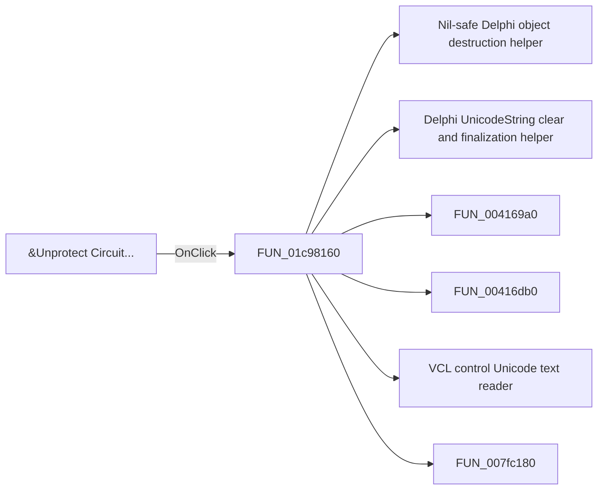

# &Unprotect Circuit...

> Analysis status: Pending individual source review.

## Control

| Property | Recovered value |
| --- | --- |
| Form | SchematicEditor |
| Component path | SchematicEditor.MainMenu.mnTools.mnUnProtect |
| Control class | TMenuItem |
| Caption | &Unprotect Circuit... |
| Hint | Not present in the recovered resource. |
| Text | Not present in the recovered resource. |
| Handler name | mnUnProtectClick |
| Handler address | 01c98160 |
| Graph node | `resource:dfm:SchematicEditor/SchematicEditor.MainMenu.mnTools.mnUnProtect` |
| Handler node | `function:01c98160` |
| Graph layer | UI |

## What happens when clicked

Pending individual analysis. An agent must read the recovered handler source and its relevant callees before it replaces this text.

## Click flow

## Handler evidence

- Source: [DecompiledSources/Tina16/functions/0000000001C98160__FUN_01c98160.c](../../../DecompiledSources/Tina16/functions/0000000001C98160__FUN_01c98160.c)
- Recovered role: Not present in the recovered resource.
- Current graph summary: Handles 1 Delphi UI event: SchematicEditor.MainMenu.mnTools.mnUnProtect.OnClick.
- Current graph behavior: Not present in the recovered resource.
- Current graph evidence: Not present in the recovered resource.
- Complexity: complex
- Distinct outgoing calls: 13

## Direct calls

- `function:00410f20` — Nil-safe Delphi object destruction helper
- `function:00414480` — Delphi UnicodeString clear and finalization helper
- `function:004169a0` — FUN_004169a0
- `function:00416db0` — FUN_00416db0
- `function:0064dd90` — VCL control Unicode text reader
- `function:007fc180` — FUN_007fc180
- `function:0080d2f0` — FUN_0080d2f0
- `function:00b94e60` — FUN_00b94e60
- `function:01994230` — FUN_01994230
- `function:019ac000` — FUN_019ac000
- `function:019ac230` — FUN_019ac230
- `function:019ac250` — FUN_019ac250
- `function:01c980e0` — FUN_01c980e0

## Resource evidence

- Kind: Not present in the recovered resource.
- Modal result: Not present in the recovered resource.
- Checked state: Not present in the recovered resource.
- List items: Not present in the recovered resource.
- Image reference: Not present in the recovered resource.
- Extracted glyph: None.

## Nearby label candidates

Nearby labels are layout candidates only. They are not proof of behavior.

- No same-parent label candidate is available.

## Analysis limits

- Do not infer behavior from the control class, caption, hint, glyph, or nearby label alone.
- Do not replace the pending status until the handler source and relevant call path provide enough evidence.
