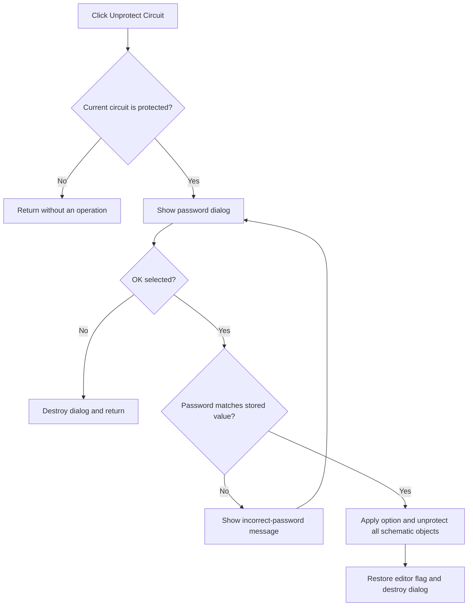

# &Unprotect Circuit...

> Analysis status: Complete.

## Control

| Property | Recovered value |
| --- | --- |
| Form | SchematicEditor |
| Component path | SchematicEditor.MainMenu.mnTools.mnUnProtect |
| Control class | TMenuItem |
| Caption | &Unprotect Circuit... |
| Handler | `mnUnProtectClick` at `01c98160` |
| Graph nodes | `resource:dfm:SchematicEditor/SchematicEditor.MainMenu.mnTools.mnUnProtect` → `function:01c98160` |
| Graph layer | UI |

## What happens when clicked

The handler first requires a current schematic record at `+0x2788` and a true protection predicate from `FUN_019ac250`. If either condition is false, it returns without an operation.

For a protected schematic, it creates a password dialog and repeats `ShowModal`. An OK result reads the password text, converts it to a short string with a 20-byte limit, and compares it with the stored circuit password at record offset `+0x293`. A mismatch shows `The password is not correct. Please try again.` and repeats the dialog. Cancel stops the loop.

When the password matches, the handler applies the dialog's selected option, temporarily sets editor flag `+0x17f0` to `1`, clears the active selection, and processes every schematic object through `FUN_01c980e0`. It restores the prior flag and destroys the dialog. There is no local exception handler.

## Click flow

## Evidence

- Handler: [FUN_01c98160](../../../DecompiledSources/Tina16/functions/0000000001C98160__FUN_01c98160.c)
- Object update: [FUN_01c980e0](../../../DecompiledSources/Tina16/functions/0000000001C980E0__FUN_01c980e0.c)
- Selection clear: [FUN_01994230](../../../DecompiledSources/Tina16/functions/0000000001994230__FUN_01994230.c)
- Recovered role: Validate the circuit password and remove protection from the active schematic.
- No image or glyph is present for this menu item.

## Analysis limits

- The recovered source does not provide the Delphi names for the protection fields or the dialog option at virtual offset `+0x260`.
