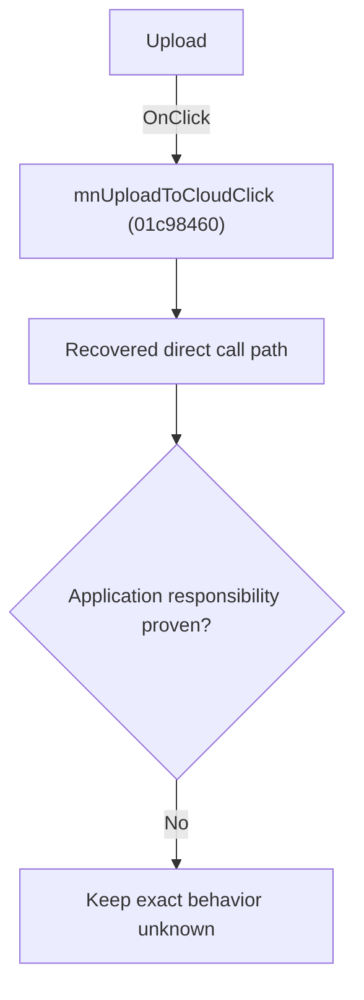

# Upload

> Analysis status: Blocked by an exact evidence gap.

## Control

| Property | Recovered value |
| --- | --- |
| Form | SchematicEditor |
| Component path | SchematicEditor.MainMenu.mnFile.mnCloud.mnUploadToCloud |
| Control class | TMenuItem |
| Caption | Upload |
| Hint | Not present in the recovered resource. |
| Text | Not present in the recovered resource. |
| Handler name | mnUploadToCloudClick |
| Handler address | 01c98460 |
| Graph node | `resource:dfm:SchematicEditor/SchematicEditor.MainMenu.mnFile.mnCloud.mnUploadToCloud` |
| Handler node | `function:01c98460` |
| Graph layer | UI |

## What happens when clicked

The OnClick binding reaches mnUploadToCloudClick at 01c98460. The recovered body has 4 distinct outgoing graph call(s), but the application-specific responsibilities and data effects of its downstream path are not established in the accepted graph evidence. The control's caption or name indicates user intent only; it is not enough to claim implementation behavior.

## Click flow

## Handler evidence

- Source: [DecompiledSources/Tina16/functions/0000000001C98460__FUN_01c98460.c](../../../DecompiledSources/Tina16/functions/0000000001C98460__FUN_01c98460.c)
- Recovered role: Evidence-blocked mnUploadToCloudClick command.
- Current graph summary: Handles 1 Delphi UI event: SchematicEditor.MainMenu.mnFile.mnCloud.mnUploadToCloud.OnClick.
- Current graph behavior: The OnClick binding reaches mnUploadToCloudClick at 01c98460. The recovered body has 4 distinct outgoing graph call(s), but the application-specific responsibilities and data effects of its downstream path are not established in the accepted graph evidence. The control's caption or name indicates user intent only; it is not enough to claim implementation behavior.
- Current graph evidence: The DFM binds SchematicEditor.MainMenu.mnFile.mnCloud.mnUploadToCloud to mnUploadToCloudClick. The recovered source is DecompiledSources/Tina16/functions/0000000001C98460__FUN_01c98460.c and directly references 014a1f90, 014c0b50, 014c4290, 01c8cf20. No accepted end-to-end role was established for this control path.
- Complexity: complex
- Distinct outgoing calls: 4

## Direct calls

- `function:014a1f90` — FUN_014a1f90
- `function:014c0b50` — FUN_014c0b50
- `function:014c4290` — FUN_014c4290
- `function:01c8cf20` — FUN_01c8cf20

## Resource evidence

- Kind: Not present in the recovered resource.
- Modal result: Not present in the recovered resource.
- Checked state: Not present in the recovered resource.
- List items: Not present in the recovered resource.
- Image reference: Not present in the recovered resource.
- Extracted glyph: None.

## Nearby label candidates

Nearby labels are layout candidates only. They are not proof of behavior.

- No same-parent label candidate is available.

## Analysis limits

- Exact gap: the recovered handler or one of its direct application callees lacks a source-supported role that proves the command's decisions, state changes, and output. Keep this Bead open until those callees are traced.

