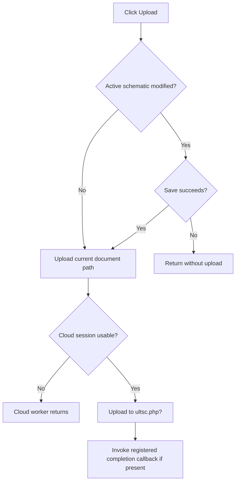

# Upload

> Analysis status: Reviewed from recovered modified-state, save gate, and cloud-upload paths.

## Control

| Property | Recovered value |
| --- | --- |
| Form | SchematicEditor |
| Component path | SchematicEditor.MainMenu.mnFile.mnCloud.mnUploadToCloud |
| Control class | TMenuItem |
| Caption | Upload |
| Hint | Not present in the recovered resource. |
| Text | Not present in the recovered resource. |
| Handler name | mnUploadToCloudClick |
| Handler address | 01c98460 |
| Graph node | `resource:dfm:SchematicEditor/SchematicEditor.MainMenu.mnFile.mnCloud.mnUploadToCloud` |
| Handler node | `function:01c98460` |
| Graph layer | UI |

## What happens when clicked

The handler tests the active schematic with `FUN_01c8cf20`. If it is not modified, it passes the current document path from the global document state directly to the cloud upload routine. If it is modified, it first calls the common save routine. It uploads only when that routine reports success. A canceled or failed save therefore prevents the upload.

The cloud routine first verifies that the cloud session is usable. It then uploads the selected schematic to the recovered `ultsc.php?` endpoint with a maximum request size of `0x2800` bytes and invokes the registered completion callback when present. The click wrapper has no local progress, completion, or error message.

## Click flow

## Handler evidence

- Source: [DecompiledSources/Tina16/functions/0000000001C98460__FUN_01c98460.c](../../../DecompiledSources/Tina16/functions/0000000001C98460__FUN_01c98460.c)
- Recovered role: Save when necessary and upload the active schematic to the cloud service.
- Current graph summary: Handles 1 Delphi UI event: SchematicEditor.MainMenu.mnFile.mnCloud.mnUploadToCloud.OnClick.
- Current graph behavior: Gates upload on document modified state and save success, then calls the shared cloud upload worker with the active path.
- Current graph evidence: `FUN_01c98460` branches on `FUN_01c8cf20`; its dirty branch requires a nonzero result from `FUN_014a1f90`. Both successful branches call `FUN_014c4290`, whose source contains `ultsc.php?`, the request-size argument, and the optional callback.
- Complexity: complex
- Distinct outgoing calls: 4

## Direct calls

- `function:014a1f90` — FUN_014a1f90
- `function:014c0b50` — FUN_014c0b50
- `function:014c4290` — FUN_014c4290
- `function:01c8cf20` — FUN_01c8cf20

## Resource evidence

- Kind: Not present in the recovered resource.
- Modal result: Not present in the recovered resource.
- Checked state: Not present in the recovered resource.
- List items: Not present in the recovered resource.
- Image reference: Not present in the recovered resource.
- Extracted glyph: None.

## Nearby label candidates

Nearby labels are layout candidates only. They are not proof of behavior.

- No same-parent label candidate is available.

## Analysis limits

- The recovered source does not expose the server response text or the callback's final UI behavior.
- The common save routine owns Save As and file-error details.

