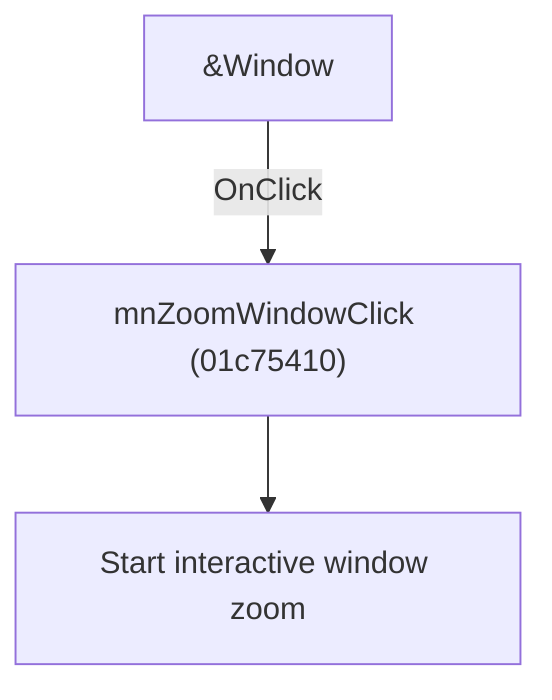

# &Window

> Analysis status: Individually reviewed.

## Control

| Property | Recovered value |
| --- | --- |
| Form | SchematicEditor |
| Component path | SchematicEditor.MainMenu.View.Zoom.mnZoomWindow |
| Control class | TMenuItem |
| Caption | &Window |
| Hint | Not present in the recovered resource. |
| Text | Not present in the recovered resource. |
| Handler name | mnZoomWindowClick |
| Handler address | 01c75410 |
| Graph node | `resource:dfm:SchematicEditor/SchematicEditor.MainMenu.View.Zoom.mnZoomWindow` |
| Handler node | `function:01c75410` |
| Graph layer | UI |

## What happens when clicked

The handler delegates to the toolbar window-zoom command, which starts the interactive zoom tool.

## Click flow

## Handler evidence

- Source: [DecompiledSources/Tina16/functions/0000000001C75410__FUN_01c75410.c](../../../DecompiledSources/Tina16/functions/0000000001C75410__FUN_01c75410.c)
- Recovered role: Activate window zoom.
- Current graph summary: Handles 1 Delphi UI event: SchematicEditor.MainMenu.View.Zoom.mnZoomWindow.OnClick.
- Current graph behavior: The handler delegates to the toolbar window-zoom command, which starts the interactive zoom tool.
- Current graph evidence: The recovered body is a single call to FUN_01c740c0, the traced ToolZoomClick handler. The menu caption is Window.
- Complexity: simple
- Distinct outgoing calls: 1

## Direct calls

- `function:01c740c0` — Handles 1 Delphi UI event: SchematicEditor.TopToolBar.EditorTools.ToolZoom.OnClick.

## Resource evidence

- Kind: Not present in the recovered resource.
- Modal result: Not present in the recovered resource.
- Checked state: Not present in the recovered resource.
- List items: Not present in the recovered resource.
- Image reference: Not present in the recovered resource.
- Extracted glyph: None.

## Nearby label candidates

Nearby labels are layout candidates only. They are not proof of behavior.

- No same-parent label candidate is available.

## Analysis limits

- The selected window is supplied by later pointer input, not by this click.

