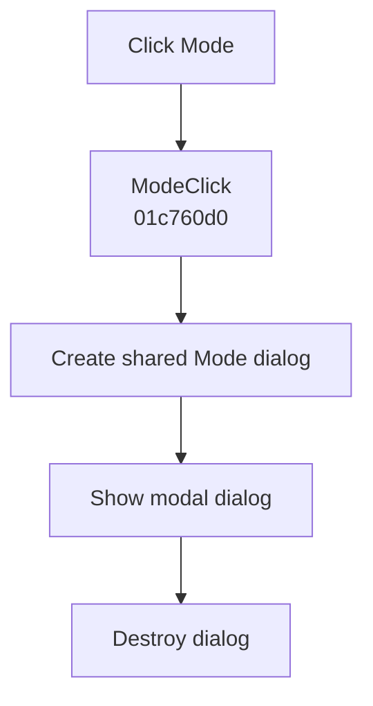

# &Mode...

> Analysis status: Complete. The recovered wrapper creates, shows, and destroys the Mode dialog.

## Control

| Property | Recovered value |
| --- | --- |
| Form | SchematicEditor |
| Component path | SchematicEditor.MainMenu.mnAnalysis.Mode |
| Control class | TMenuItem |
| Caption | &Mode... |
| Hint | Not present in the recovered resource. |
| Text | Not present in the recovered resource. |
| Handler name | ModeClick |
| Handler address | 01c760d0 |
| Graph node | `resource:dfm:SchematicEditor/SchematicEditor.MainMenu.mnAnalysis.Mode` |
| Handler node | `function:01c760d0` |
| Graph layer | UI |

## What happens when clicked

`FUN_01c760d0` creates an instance of the recovered class referenced by `PTR_FUN_01154178`, shows it modally through VMT offset `+0x2d0`, ignores the modal result, and destroys the object.

The identical `NetlistEditor.MIModeClick` wrapper confirms that this class is the shared Mode dialog. Any setting commit happens inside the dialog; this wrapper does not copy fields after it closes.

## Click flow

## Handler evidence

- Source: [DecompiledSources/Tina16/functions/0000000001C760D0__FUN_01c760d0.c](../../../DecompiledSources/Tina16/functions/0000000001C760D0__FUN_01c760d0.c)
- Recovered role: Opens the shared Mode dialog and releases it after it closes.
- Current graph summary: Handles 1 Delphi UI event: SchematicEditor.MainMenu.mnAnalysis.Mode.OnClick.
- Current graph behavior: Creates the recovered Mode dialog, executes it modally, ignores its result, and destroys it.
- Current graph evidence: `FUN_01c760d0` calls `FUN_007fc180` with `PTR_FUN_01154178`, dispatches the modal method at VMT offset `+0x2d0`, and calls the nil-safe object destructor. `NetlistEditor.MIModeClick` has the same recovered body and menu purpose.
- Complexity: moderate
- Distinct outgoing calls: 2

## Direct calls

- `function:00410f20` — Destroys the dialog when it is not nil
- `function:007fc180` — Constructs the shared Mode dialog

## Resource evidence

- Kind: Not present in the recovered resource.
- Modal result: Not present in the recovered resource.
- Checked state: Not present in the recovered resource.
- List items: Not present in the recovered resource.
- Image reference: Not present in the recovered resource.
- Extracted glyph: None.

## Nearby label candidates

Nearby labels are layout candidates only. They are not proof of behavior.

- No same-parent label candidate is available.

## Analysis limits

- The dialog's Delphi class name is not recovered.
- The wrapper does not reveal which settings the dialog commits internally.
