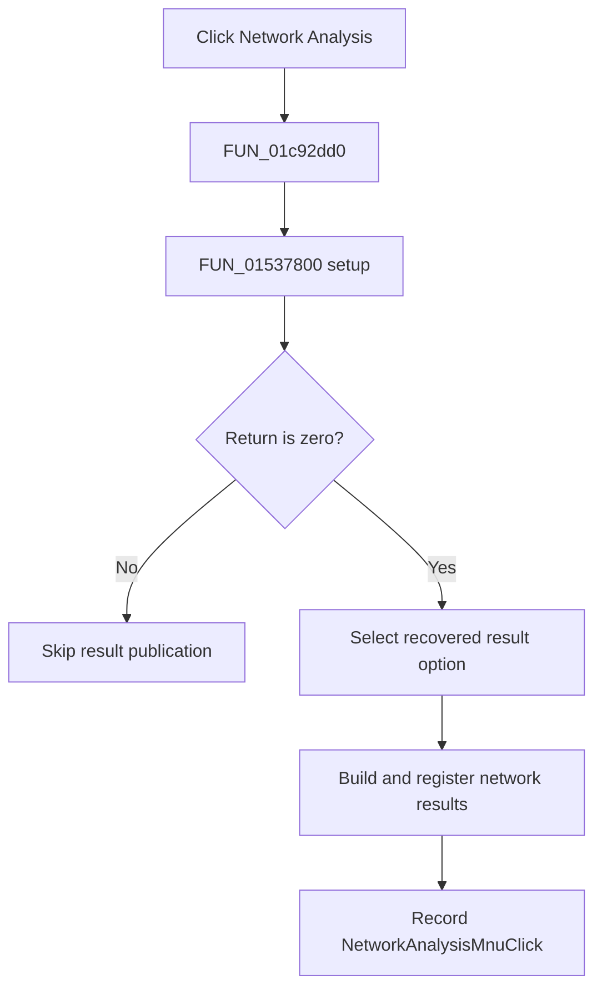

# &Network Analysis...

> Analysis status: Complete. The setup branch and named network-result publisher establish the flow.

## Control

| Property | Recovered value |
| --- | --- |
| Form | SchematicEditor |
| Component path | SchematicEditor.MainMenu.mnAnalysis.ACAnalysis.NetworkAnalysisMnu |
| Control class | TMenuItem |
| Caption | &Network Analysis... |
| Hint | Not present in the recovered resource. |
| Text | Not present in the recovered resource. |
| Handler name | NetworkAnalysisMnuClick |
| Handler address | 01c92dd0 |
| Graph node | `resource:dfm:SchematicEditor/SchematicEditor.MainMenu.mnAnalysis.ACAnalysis.NetworkAnalysisMnu` |
| Handler node | `function:01c92dd0` |
| Graph layer | UI |

## What happens when clicked

`FUN_01c92dd0` calls the shared network-analysis setup routine `FUN_01537800` with the active schematic circuit. Only a zero return continues. The handler derives the result option with `FUN_01536240`, then calls `FUN_013d6a00` to build and register network-analysis views. The publisher contains recovered outputs such as amplitude, phase, Bode, group delay, loss, VSWR, Smith, and polar results. The handler then stores `NetworkAnalysisMnuClick` as the last command. A nonzero setup return skips publication and the state write.

## Click flow

## Handler evidence

- Source: [DecompiledSources/Tina16/functions/0000000001C92DD0__FUN_01c92dd0.c](../../../DecompiledSources/Tina16/functions/0000000001C92DD0__FUN_01c92dd0.c)
- Recovered role: Runs network-analysis setup and publishes network results on a zero return.
- Current graph summary: Handles 1 Delphi UI event: SchematicEditor.MainMenu.mnAnalysis.ACAnalysis.NetworkAnalysisMnu.OnClick.
- Current graph behavior: Runs network setup, builds the selected network result views only on a zero return, and records the command name.
- Current graph evidence: The handler branches on `FUN_01537800`, passes a value from `FUN_01536240` to `FUN_013d6a00`, and writes `NetworkAnalysisMnuClick`. The result builder contains named network outputs including Bode, group delay, VSWR, Smith, and polar views.
- Complexity: complex
- Distinct outgoing calls: 4

## Direct calls

- `function:00414ad0` — Delphi UnicodeString assignment helper
- `function:013d6a00` — FUN_013d6a00
- `function:01536240` — FUN_01536240
- `function:01537800` — FUN_01537800

## Resource evidence

- Kind: Not present in the recovered resource.
- Modal result: Not present in the recovered resource.
- Checked state: Not present in the recovered resource.
- List items: Not present in the recovered resource.
- Image reference: Not present in the recovered resource.
- Extracted glyph: None.

## Nearby label candidates

Nearby labels are layout candidates only. They are not proof of behavior.

- No same-parent label candidate is available.

## Analysis limits

- The exact meanings of nonzero setup returns and the numeric result option are not recovered.

