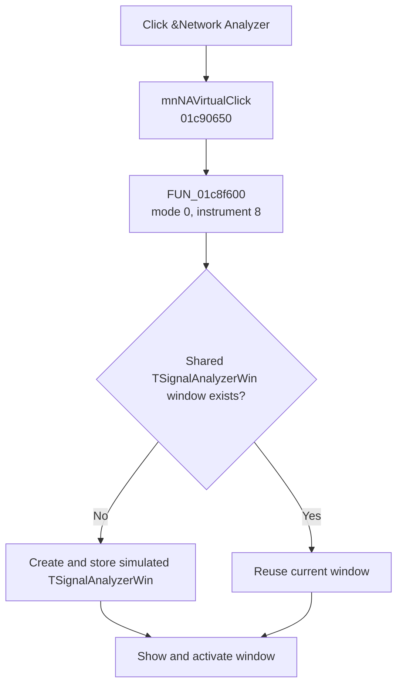

# &Network Analyzer

> Analysis status: Evidence-backed source review complete.

## Control

| Property | Recovered value |
| --- | --- |
| Form | SchematicEditor |
| Component path | SchematicEditor.MainMenu.mnTM.NetworkAnalyzer |
| Control class | TMenuItem |
| Caption | &Network Analyzer |
| Hint | Not present in the recovered resource. |
| Text | Not present in the recovered resource. |
| Handler name | mnNAVirtualClick |
| Handler address | 01c90650 |
| Graph node | `resource:dfm:SchematicEditor/SchematicEditor.MainMenu.mnTM.NetworkAnalyzer` |
| Handler node | `function:01c90650` |
| Graph layer | UI |

## What happens when clicked

`mnNAVirtualClick` calls [`FUN_01c8f600`](../../../DecompiledSources/Tina16/functions/0000000001C8F600__FUN_01c8f600.c) with mode `0` and recovered instrument ID `8`. The common launcher treats this as one simulated instrument choice. It reads the shared window slot for this instrument. If the slot is empty, it creates a `TSignalAnalyzerWin` window from VMT `0137f9e0`, stores the instance, and initializes it with the simulated mode and instrument ID. It then makes the window visible and activates it. If the window already exists, the launcher reuses and activates it.

No device-selection dialog is needed for this simulated path. The recovered launcher has no local error message or confirmation for this mode. The same handler is bound to the instrument's main menu entry and its **Simulated** submenu entry; both controls therefore run the same path.

## Click flow

## Handler evidence

- Source: [DecompiledSources/Tina16/functions/0000000001C90650__FUN_01c90650.c](../../../DecompiledSources/Tina16/functions/0000000001C90650__FUN_01c90650.c)
- Recovered role: Open or activate the simulated TSignalAnalyzerWin instrument window.
- Current graph summary: Handles 2 Delphi UI events: SchematicEditor.MainMenu.mnTM.NetworkAnalyzer1.Virtual1.OnClick, SchematicEditor.MainMenu.mnTM.NetworkAnalyzer.OnClick.
- Current graph behavior: Passes simulated mode 0 and instrument ID 8 to the shared instrument launcher. The launcher creates or reuses a TSignalAnalyzerWin window, then shows and activates it.
- Current graph evidence: The DFM binds SchematicEditor.MainMenu.mnTM.NetworkAnalyzer, SchematicEditor.MainMenu.mnTM.NetworkAnalyzer1.Virtual1 to mnNAVirtualClick. The handler passes constants 0 and 8 to FUN_01c8f600. That callee's instrument switch uses VMT 0137f9e0, which manual read-only VMT inspection identifies as TSignalAnalyzerWin; its device-count, selection-dialog, shared-instance, visibility, and activation branches establish the behavior.
- Complexity: simple
- Distinct outgoing calls: 1

## Direct calls

- `function:01c8f600` — [FUN_01c8f600](../../../DecompiledSources/Tina16/functions/0000000001C8F600__FUN_01c8f600.c), the shared instrument discovery and window launcher.

## Resource evidence

- Kind: Not present in the recovered resource.
- Modal result: Not present in the recovered resource.
- Checked state: Not present in the recovered resource.
- List items: Not present in the recovered resource.
- Image reference: Not present in the recovered resource.
- Extracted glyph: None.

## Nearby label candidates

Nearby labels are layout candidates only. They are not proof of behavior.

- No same-parent label candidate is available.

## Analysis limits

- The recovered numeric instrument ID is used because its original Delphi enumeration name is not available.
- The launcher proves device discovery and window activation. It does not prove the external hardware connection state after the window opens.

