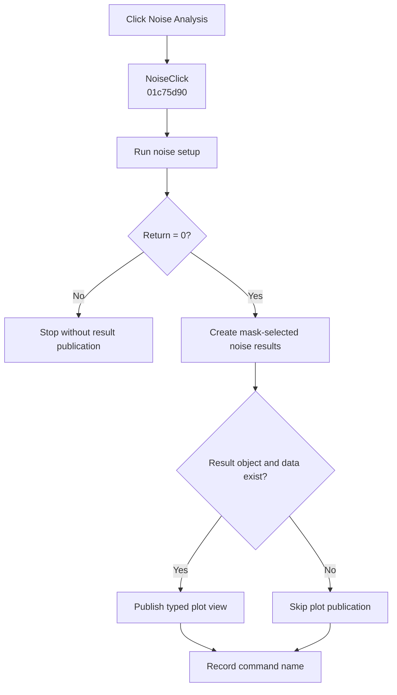

# &Noise Analysis...

> Analysis status: Complete. A zero setup result runs noise analysis and publishes its selected result and plot views.

## Control

| Property | Recovered value |
| --- | --- |
| Form | SchematicEditor |
| Component path | SchematicEditor.MainMenu.mnAnalysis.Noise |
| Control class | TMenuItem |
| Caption | &Noise Analysis... |
| Hint | Not present in the recovered resource. |
| Text | Not present in the recovered resource. |
| Handler name | NoiseClick |
| Handler address | 01c75d90 |
| Graph node | `resource:dfm:SchematicEditor/SchematicEditor.MainMenu.mnAnalysis.Noise` |
| Handler node | `function:01c75d90` |
| Graph layer | UI |

## What happens when clicked

`FUN_01c75d90` calls `FUN_014f6590` with the active schematic. A nonzero return stops the handler without result publication or command recording.

For a zero return, the handler calls `FUN_013d8d70` with the active circuit result, the recovered global result-mask byte, and interactive flag `1`. That routine can create Output noise, Input noise, Total noise, and Signal to Noise result sets according to the mask. If the active result object and its data pointer exist, the handler publishes the applicable typed plot view through `FUN_013c7550`. It then records `NoiseClick`.

## Click flow

## Handler evidence

- Source: [DecompiledSources/Tina16/functions/0000000001C75D90__FUN_01c75d90.c](../../../DecompiledSources/Tina16/functions/0000000001C75D90__FUN_01c75d90.c)
- Recovered role: Runs and publishes mask-selected noise analysis after accepted setup.
- Current graph summary: Handles 1 Delphi UI event: SchematicEditor.MainMenu.mnAnalysis.Noise.OnClick.
- Current graph behavior: Stops on a nonzero setup result. Otherwise, creates the selected noise result sets, publishes an available typed plot view, and records the command.
- Current graph evidence: `FUN_01c75d90` branches on `FUN_014f6590`, calls `FUN_013d8d70` only for zero with global mask byte `PTR_DAT_02004010[0x3ba]`, then conditionally calls the annotated plot publisher for the active result type. The NetlistEditor Noise Analysis path confirms the same setup and result-builder roles.
- Complexity: complex
- Distinct outgoing calls: 4

## Direct calls

- `function:00414ad0` — Records the command name
- `function:013c7550` — Publishes the available typed plot result
- `function:013d8d70` — Creates result sets selected by the recovered noise mask
- `function:014f6590` — Owns noise setup and returns a stop-or-continue status

## Resource evidence

- Kind: Not present in the recovered resource.
- Modal result: Not present in the recovered resource.
- Checked state: Not present in the recovered resource.
- List items: Not present in the recovered resource.
- Image reference: Not present in the recovered resource.
- Extracted glyph: None.

## Nearby label candidates

Nearby labels are layout candidates only. They are not proof of behavior.

- No same-parent label candidate is available.

## Analysis limits

- The wrapper does not distinguish cancellation from other nonzero setup results.
- The handler has no local exception, retry, or rollback path.
