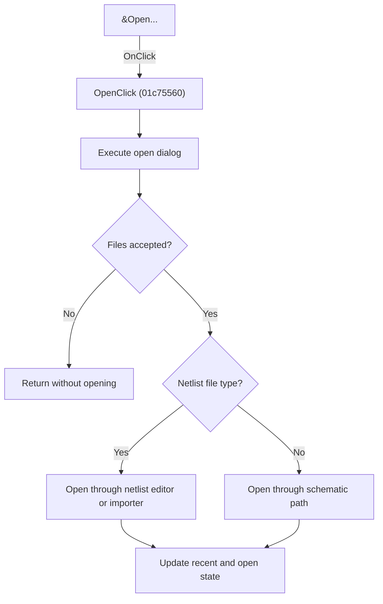

# &Open...

> Analysis status: Individually reviewed.

## Control

| Property | Recovered value |
| --- | --- |
| Form | SchematicEditor |
| Component path | SchematicEditor.MainMenu.mnFile.Open |
| Control class | TMenuItem |
| Caption | &Open... |
| Hint | Not present in the recovered resource. |
| Text | Not present in the recovered resource. |
| Handler name | OpenClick |
| Handler address | 01c75560 |
| Graph node | `resource:dfm:SchematicEditor/SchematicEditor.MainMenu.mnFile.Open` |
| Handler node | `function:01c75560` |
| Graph layer | UI |

## What happens when clicked

The handler executes the configured open dialog and processes each accepted file. A recovered file-type branch sends netlists through the netlist editor and import path; other supported selections use the schematic-open path. It updates recent-file and open-document state. Canceling produces no file operation. The menu and toolbar controls share this behavior.

## Click flow

## Handler evidence

- Source: [DecompiledSources/Tina16/functions/0000000001C75560__FUN_01c75560.c](../../../DecompiledSources/Tina16/functions/0000000001C75560__FUN_01c75560.c)
- Recovered role: Open selected schematic or netlist files.
- Current graph summary: Handles 2 Delphi UI events: SchematicEditor.TopToolBar.GeneralTools.DFOpenBtn.OnClick, SchematicEditor.MainMenu.mnFile.Open.OnClick.
- Current graph behavior: The handler executes the configured open dialog and processes each accepted file. A recovered file-type branch sends netlists through the netlist editor and import path; other supported selections use the schematic-open path. It updates recent-file and open-document state. Canceling produces no file operation. The menu and toolbar controls share this behavior.
- Current graph evidence: The recovered body tests the open-dialog result, iterates its Files collection, branches on recovered type value 3, calls distinct netlist and schematic helpers, and updates recent/open state. Sender is only forwarded into the netlist branch and does not select the top-level operation.
- Complexity: complex
- Distinct outgoing calls: 11

## Direct calls

- `function:00414480` — Delphi UnicodeString clear and finalization helper
- `function:00414560` — Delphi UnicodeString array finalization helper
- `function:00441640` — FUN_00441640
- `function:007241d0` — FUN_007241d0
- `function:00724270` — FUN_00724270
- `function:00724300` — FUN_00724300
- `function:00724380` — FUN_00724380
- `function:01530bb0` — FUN_01530bb0
- `function:0177d560` — FUN_0177d560
- `function:01c681b0` — FUN_01c681b0
- `function:01c806a0` — Handles 1 Delphi UI event: SchematicEditor.MainMenu.mnTools.mnSPiceEditor.OnClick.

## Resource evidence

- Kind: Not present in the recovered resource.
- Modal result: Not present in the recovered resource.
- Checked state: Not present in the recovered resource.
- List items: Not present in the recovered resource.
- Image reference: Not present in the recovered resource.
- Extracted glyph: None.

## Nearby label candidates

Nearby labels are layout candidates only. They are not proof of behavior.

- No same-parent label candidate is available.

## Analysis limits

- The numeric dialog type values other than the traced netlist value are not named.

