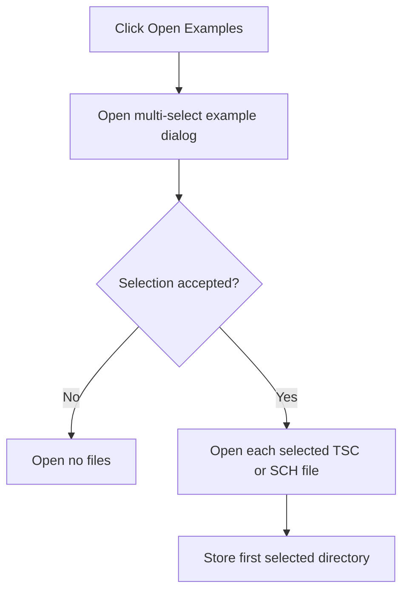

# Open Examples...

> Analysis status: Reviewed from the example roots, multi-select dialog, and schematic-loader path.

## Control

| Property | Recovered value |
| --- | --- |
| Form | SchematicEditor |
| Component path | SchematicEditor.MainMenu.mnFile.OpenExamples |
| Control class | TMenuItem |
| Caption | Open Examples... |
| Hint | Not present in the recovered resource. |
| Text | Not present in the recovered resource. |
| Handler name | OpenExamplesClick |
| Handler address | 01c9c3b0 |
| Graph node | `resource:dfm:SchematicEditor/SchematicEditor.MainMenu.mnFile.OpenExamples` |
| Handler node | `function:01c9c3b0` |
| Graph layer | UI |

## What happens when clicked

The handler creates `OpenExamplesDlg` with the initial TINA Examples path, the title `Open Schematic`, and a filter for `*.TSC` and `*.SCH`. It adds User Examples, Infineon, TI, and TINA Examples as navigation roots and enables multiple selection. Cancel opens nothing. After acceptance, the handler loops through all selected paths and opens each schematic. It stores the directory of the first selected file in the editor for later use.

## Click flow

## Handler evidence

- Source: [DecompiledSources/Tina16/functions/0000000001C9C3B0__FUN_01c9c3b0.c](../../../DecompiledSources/Tina16/functions/0000000001C9C3B0__FUN_01c9c3b0.c)
- Recovered role: Select and open one or more example schematics.
- Current graph summary: Handles 1 Delphi UI event: SchematicEditor.MainMenu.mnFile.OpenExamples.OnClick.
- Current graph behavior: Configures an example-aware multi-select dialog, opens every accepted schematic path, and remembers the first selected directory.
- Current graph evidence: `FUN_01c9c3b0` initializes the dialog with `<install>\Examples`, the TSC/SCH filter, and four named roots. It sets multiselect flags, branches on dialog acceptance, iterates every selected path, and calls `FUN_01c681b0` for each. It derives the first path's directory and stores it at editor offset `+0x18f0`.
- Complexity: complex
- Distinct outgoing calls: 13

## Direct calls

- `function:00410f20` — Nil-safe Delphi object destruction helper
- `function:00414480` — Delphi UnicodeString clear and finalization helper
- `function:00414560` — Delphi UnicodeString array finalization helper
- `function:00414ad0` — Delphi UnicodeString assignment helper
- `function:00416ba0` — FUN_00416ba0
- `function:00416cd0` — FUN_00416cd0
- `function:00441640` — FUN_00441640
- `function:007241d0` — FUN_007241d0
- `function:00c78ad0` — FUN_00c78ad0
- `function:0177ce70` — FUN_0177ce70
- `function:0177d560` — FUN_0177d560
- `function:0177d6b0` — FUN_0177d6b0
- `function:01c681b0` — FUN_01c681b0

## Resource evidence

- Kind: Not present in the recovered resource.
- Modal result: Not present in the recovered resource.
- Checked state: Not present in the recovered resource.
- List items: Not present in the recovered resource.
- Image reference: Not present in the recovered resource.
- Extracted glyph: None.

## Nearby label candidates

Nearby labels are layout candidates only. They are not proof of behavior.

- No same-parent label candidate is available.

## Analysis limits

- A failure while opening one selected file is handled below `FUN_01c681b0`; this handler has no local per-file error branch.

