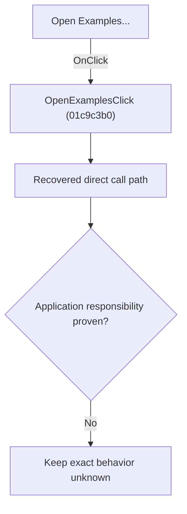

# Open Examples...

> Analysis status: Blocked by an exact evidence gap.

## Control

| Property | Recovered value |
| --- | --- |
| Form | SchematicEditor |
| Component path | SchematicEditor.MainMenu.mnFile.OpenExamples |
| Control class | TMenuItem |
| Caption | Open Examples... |
| Hint | Not present in the recovered resource. |
| Text | Not present in the recovered resource. |
| Handler name | OpenExamplesClick |
| Handler address | 01c9c3b0 |
| Graph node | `resource:dfm:SchematicEditor/SchematicEditor.MainMenu.mnFile.OpenExamples` |
| Handler node | `function:01c9c3b0` |
| Graph layer | UI |

## What happens when clicked

The OnClick binding reaches OpenExamplesClick at 01c9c3b0. The recovered body has 13 distinct outgoing graph call(s), but the application-specific responsibilities and data effects of its downstream path are not established in the accepted graph evidence. The control's caption or name indicates user intent only; it is not enough to claim implementation behavior.

## Click flow

## Handler evidence

- Source: [DecompiledSources/Tina16/functions/0000000001C9C3B0__FUN_01c9c3b0.c](../../../DecompiledSources/Tina16/functions/0000000001C9C3B0__FUN_01c9c3b0.c)
- Recovered role: Evidence-blocked OpenExamplesClick command.
- Current graph summary: Handles 1 Delphi UI event: SchematicEditor.MainMenu.mnFile.OpenExamples.OnClick.
- Current graph behavior: The OnClick binding reaches OpenExamplesClick at 01c9c3b0. The recovered body has 13 distinct outgoing graph call(s), but the application-specific responsibilities and data effects of its downstream path are not established in the accepted graph evidence. The control's caption or name indicates user intent only; it is not enough to claim implementation behavior.
- Current graph evidence: The DFM binds SchematicEditor.MainMenu.mnFile.OpenExamples to OpenExamplesClick. The recovered source is DecompiledSources/Tina16/functions/0000000001C9C3B0__FUN_01c9c3b0.c and directly references 00410f20, 00414480, 00414560, 00414ad0, 00416ba0, 00416cd0, 00441640, 007241d0, and 5 more. No accepted end-to-end role was established for this control path.
- Complexity: complex
- Distinct outgoing calls: 13

## Direct calls

- `function:00410f20` — Nil-safe Delphi object destruction helper
- `function:00414480` — Delphi UnicodeString clear and finalization helper
- `function:00414560` — Delphi UnicodeString array finalization helper
- `function:00414ad0` — Delphi UnicodeString assignment helper
- `function:00416ba0` — FUN_00416ba0
- `function:00416cd0` — FUN_00416cd0
- `function:00441640` — FUN_00441640
- `function:007241d0` — FUN_007241d0
- `function:00c78ad0` — FUN_00c78ad0
- `function:0177ce70` — FUN_0177ce70
- `function:0177d560` — FUN_0177d560
- `function:0177d6b0` — FUN_0177d6b0
- `function:01c681b0` — FUN_01c681b0

## Resource evidence

- Kind: Not present in the recovered resource.
- Modal result: Not present in the recovered resource.
- Checked state: Not present in the recovered resource.
- List items: Not present in the recovered resource.
- Image reference: Not present in the recovered resource.
- Extracted glyph: None.

## Nearby label candidates

Nearby labels are layout candidates only. They are not proof of behavior.

- No same-parent label candidate is available.

## Analysis limits

- Exact gap: the recovered handler or one of its direct application callees lacks a source-supported role that proves the command's decisions, state changes, and output. Keep this Bead open until those callees are traced.

