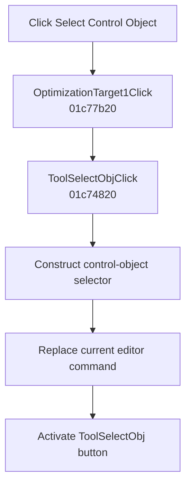

# Select &Control Object

> Analysis status: Complete. The menu delegates to the recovered control-object selector command.

## Control

| Property | Recovered value |
| --- | --- |
| Form | SchematicEditor |
| Component path | SchematicEditor.MainMenu.mnAnalysis.OptimizationTarget1 |
| Control class | TMenuItem |
| Caption | Select &Control Object |
| Hint | Not present in the recovered resource. |
| Text | Not present in the recovered resource. |
| Handler name | OptimizationTarget1Click |
| Handler address | 01c77b20 |
| Graph node | `resource:dfm:SchematicEditor/SchematicEditor.MainMenu.mnAnalysis.OptimizationTarget1` |
| Handler node | `function:01c77b20` |
| Graph layer | UI |

## What happens when clicked

`FUN_01c77b20` delegates directly to `FUN_01c74820`, the handler also bound to `TopToolBar.EditorTools.ToolSelectObj`. That handler constructs the selector class at `PTR_FUN_01362680`, closes the current editor command where required, replaces the editor's command pointer at offset `+7000`, and activates the `ToolSelectObj` toolbar button.

This menu command selects the object used for parameter stepping or optimization. It does not select an optimization target or run an optimization.

## Click flow

## Handler evidence

- Source: [DecompiledSources/Tina16/functions/0000000001C77B20__FUN_01c77b20.c](../../../DecompiledSources/Tina16/functions/0000000001C77B20__FUN_01c77b20.c)
- Recovered role: Delegates to the control-object selection command.
- Current graph summary: Handles 1 Delphi UI event: SchematicEditor.MainMenu.mnAnalysis.OptimizationTarget1.OnClick.
- Current graph behavior: Calls the toolbar control-object handler, which constructs its selector, replaces the current editor command, and activates ToolSelectObj.
- Current graph evidence: `FUN_01c77b20` contains only the call to `FUN_01c74820`. The delegated function constructs the class at `PTR_FUN_01362680`, passes it to `FUN_01c6cee0`, and calls `FUN_01c6d670` for the toolbar object at form offset `+0xb68`. The toolbar hint identifies control-object selection for stepping or optimization.
- Complexity: simple
- Distinct outgoing calls: 1

## Direct calls

- `function:01c74820` — Constructs and activates the control-object selector command

## Resource evidence

- Kind: Not present in the recovered resource.
- Modal result: Not present in the recovered resource.
- Checked state: Not present in the recovered resource.
- List items: Not present in the recovered resource.
- Image reference: Not present in the recovered resource.
- Extracted glyph: None.

## Nearby label candidates

Nearby labels are layout candidates only. They are not proof of behavior.

- No same-parent label candidate is available.

## Analysis limits

- The Delphi class name of the selector object is not recovered.
- Actual object selection occurs in the constructed command after this click.
