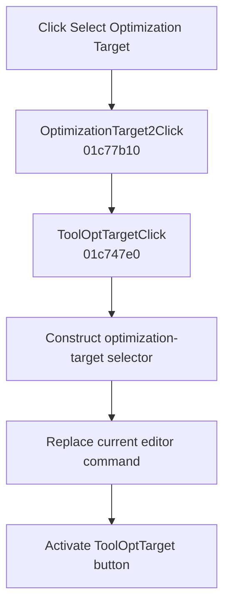

# Select &Optimization Target

> Analysis status: Complete. The menu delegates to the recovered optimization-target selector command.

## Control

| Property | Recovered value |
| --- | --- |
| Form | SchematicEditor |
| Component path | SchematicEditor.MainMenu.mnAnalysis.OptimizationTarget2 |
| Control class | TMenuItem |
| Caption | Select &Optimization Target |
| Hint | Not present in the recovered resource. |
| Text | Not present in the recovered resource. |
| Handler name | OptimizationTarget2Click |
| Handler address | 01c77b10 |
| Graph node | `resource:dfm:SchematicEditor/SchematicEditor.MainMenu.mnAnalysis.OptimizationTarget2` |
| Handler node | `function:01c77b10` |
| Graph layer | UI |

## What happens when clicked

`FUN_01c77b10` delegates directly to `FUN_01c747e0`, the handler also bound to `TopToolBar.EditorTools.ToolOptTarget`. That handler constructs the selector class at `PTR_FUN_013623f0`, closes the current editor command where required, replaces the editor's command pointer at offset `+7000`, and activates the `ToolOptTarget` toolbar button.

This menu command selects the target of optimization mode. It does not select the control object or run an optimization.

## Click flow

## Handler evidence

- Source: [DecompiledSources/Tina16/functions/0000000001C77B10__FUN_01c77b10.c](../../../DecompiledSources/Tina16/functions/0000000001C77B10__FUN_01c77b10.c)
- Recovered role: Delegates to the optimization-target selection command.
- Current graph summary: Handles 1 Delphi UI event: SchematicEditor.MainMenu.mnAnalysis.OptimizationTarget2.OnClick.
- Current graph behavior: Calls the toolbar optimization-target handler, which constructs its selector, replaces the current editor command, and activates ToolOptTarget.
- Current graph evidence: `FUN_01c77b10` contains only the call to `FUN_01c747e0`. The delegated function constructs the class at `PTR_FUN_013623f0`, passes it to `FUN_01c6cee0`, and calls `FUN_01c6d670` for the toolbar object at form offset `+0xb70`. The toolbar hint identifies optimization-target selection.
- Complexity: simple
- Distinct outgoing calls: 1

## Direct calls

- `function:01c747e0` — Constructs and activates the optimization-target selector command

## Resource evidence

- Kind: Not present in the recovered resource.
- Modal result: Not present in the recovered resource.
- Checked state: Not present in the recovered resource.
- List items: Not present in the recovered resource.
- Image reference: Not present in the recovered resource.
- Extracted glyph: None.

## Nearby label candidates

Nearby labels are layout candidates only. They are not proof of behavior.

- No same-parent label candidate is available.

## Analysis limits

- The Delphi class name of the selector object is not recovered.
- Actual target selection occurs in the constructed command after this click.
