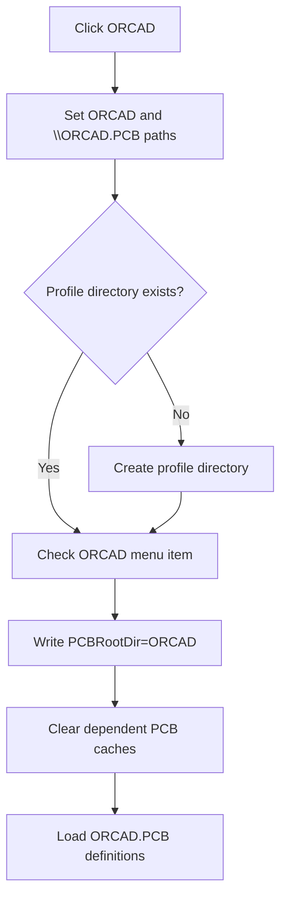

# ORCAD

> Analysis status: Reviewed from the recovered PCB profile, directory, settings, cache, and menu-state path.

## Control

| Property | Recovered value |
| --- | --- |
| Form | SchematicEditor |
| Component path | SchematicEditor.MainMenu.mnFile.pcbdirectory1.ORCADPCB1 |
| Control class | TMenuItem |
| Caption | ORCAD |
| Hint | Not present in the recovered resource. |
| Text | Not present in the recovered resource. |
| Handler name | ORCADPCB1Click |
| Handler address | 01c94cb0 |
| Graph node | `resource:dfm:SchematicEditor/SchematicEditor.MainMenu.mnFile.pcbdirectory1.ORCADPCB1` |
| Handler node | `function:01c94cb0` |
| Graph layer | UI |

## What happens when clicked

The handler selects the ORCAD PCB profile. It clears the prior PCB-directory cache, sets the profile file to `\ORCAD.PCB` and the profile key to `ORCAD`, creates the profile directory when absent, and checks this menu item. It writes `PCBRootDir=ORCAD` in the `Schematic Editor` settings section, clears two dependent caches, and reloads the ORCAD `.PCB` definition data. It does not export a board here.

## Click flow

## Handler evidence

- Source: [DecompiledSources/Tina16/functions/0000000001C94CB0__FUN_01c94cb0.c](../../../DecompiledSources/Tina16/functions/0000000001C94CB0__FUN_01c94cb0.c)
- Recovered role: Select and load the ORCAD PCB profile.
- Current graph summary: Handles 1 Delphi UI event: SchematicEditor.MainMenu.mnFile.pcbdirectory1.ORCADPCB1.OnClick.
- Current graph behavior: Selects, persists, and reloads the ORCAD PCB definition profile.
- Current graph evidence: `FUN_01c94cb0` contains the exact path, profile, settings section, and key; calls the checked-state setter; clears caches; and passes ORCAD to the recovered `.PCB` loader.
- Complexity: complex
- Distinct outgoing calls: 10

## Direct calls

- `function:00414560` — Delphi UnicodeString array finalization helper
- `function:00414ad0` — Delphi UnicodeString assignment helper
- `function:00416ba0` — FUN_00416ba0
- `function:00442400` — FUN_00442400
- `function:007e2d20` — FUN_007e2d20
- `function:00b96de0` — FUN_00b96de0
- `function:00eadc90` — FUN_00eadc90
- `function:00eae050` — FUN_00eae050
- `function:00ec0300` — FUN_00ec0300
- `function:00ecbc20` — FUN_00ecbc20

## Resource evidence

- Kind: Not present in the recovered resource.
- Modal result: Not present in the recovered resource.
- Checked state: Not present in the recovered resource.
- List items: Not present in the recovered resource.
- Image reference: Not present in the recovered resource.
- Extracted glyph: None.

## Nearby label candidates

Nearby labels are layout candidates only. They are not proof of behavior.

- No same-parent label candidate is available.

## Analysis limits

- The settings object's storage backend is called through a virtual method and is not named here. Directory or load errors are not caught locally.

