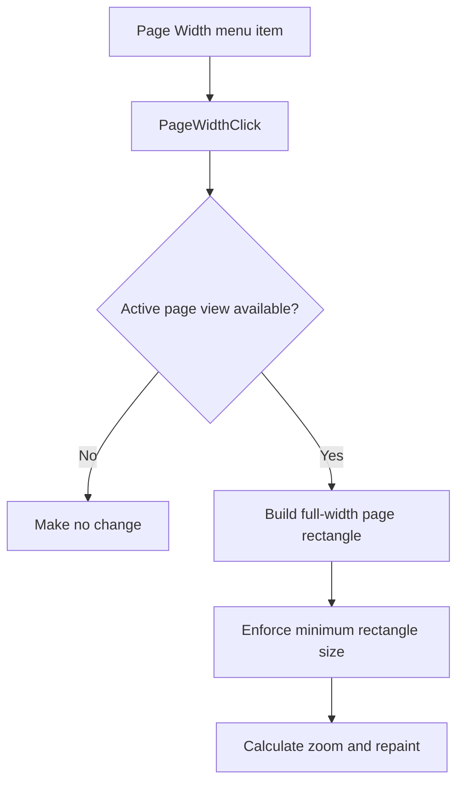

# Page Wi&dth

> Analysis status: Reviewed with recovered zoom-rectangle evidence.

## Control

| Property | Recovered value |
| --- | --- |
| Component path | `SchematicEditor.MainMenu.View.Zoom.PageWidth` |
| Control class | `TMenuItem` |
| Handler | `PageWidthClick` at `01c83ef0` |

## What happens when clicked

The command runs only when an active schematic and its page view are available. It builds a rectangle across the full recovered page width. The common zoom helper expands a dimension that is less than 40 coordinate units, transforms the rectangle for the active view, calculates the zoom, and repaints the editor. This makes the page width fit the available view.

## Click flow

## Evidence

- [Handler source](../../../DecompiledSources/Tina16/functions/0000000001C83EF0__FUN_01c83ef0.c) supplies the page origin and full page width to the common zoom helper.
- [Zoom helper](../../../DecompiledSources/Tina16/functions/0000000001C750D0__FUN_01c750d0.c) normalizes, transforms, fits, and repaints the supplied rectangle.

## Analysis limits

- The recovered code does not expose the final numeric zoom percentage.
