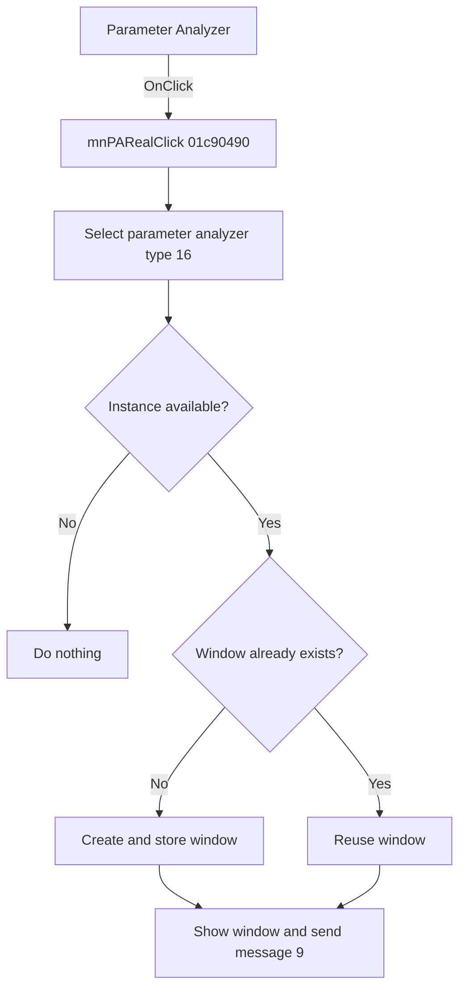

# Pa&rameter Analyzer

> Analysis status: Reviewed from recovered source and resource evidence.

## Control

| Property | Recovered value |
| --- | --- |
| Form | SchematicEditor |
| Component path | SchematicEditor.MainMenu.mnTM.ParameterAnalyzer |
| Control class | TMenuItem |
| Caption | Pa&rameter Analyzer |
| Handler | mnPARealClick at `01c90490` |
| Graph node | `resource:dfm:SchematicEditor/SchematicEditor.MainMenu.mnTM.ParameterAnalyzer` |

## What happens when clicked

The click opens or reuses a parameter analyzer window. `mnPARealClick` passes mode `1` and instrument type `16` to the shared coordinator at `01c8f600`.

The coordinator stops when no instance is available. For multiple instances, it shows a selector and continues only with an in-range index. It reuses the selected window or creates and stores a new one, adds an instance label to a new caption when applicable, shows the window, and sends native message `9`.

## Click flow

## Handler evidence

- [Handler source](../../../DecompiledSources/Tina16/functions/0000000001C90490__FUN_01c90490.c) calls `FUN_01c8f600(form, 1, 16)`.
- [Coordinator source](../../../DecompiledSources/Tina16/functions/0000000001C8F600__FUN_01c8f600.c) selects the type-`16` class and state table, then proves the availability, selection, reuse, creation, caption, show, and message paths.

## Analysis limits

- The recovered source does not identify native message `9` or show a separate modal-cancel test.
