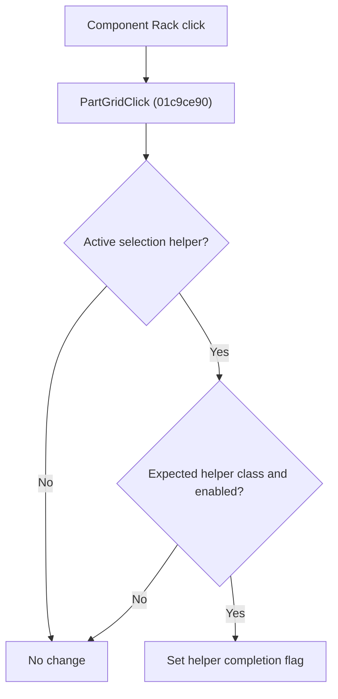

# Component Rack

> Analysis status: Reviewed from recovered source and resource evidence.

## Control

| Property | Recovered value |
| --- | --- |
| Form | SchematicEditor |
| Component path | SchematicEditor.ComponentPanel.PartGrid |
| Control class | TPartGrid |
| Hint | Component Rack\|Select the component you want to place |
| Handler name | PartGridClick |
| Handler address | 01c9ce90 |

## What happens when clicked

The handler reads the active editor selection helper at form offset `0x1b58`. If no helper is active, the click has no effect. If the helper has the expected recovered class and its byte at offset `0x24` is set, the handler sets the helper byte at offset `0x21` to `1`. This signals that the active rack-selection step is complete. The handler does not place or change a component directly.

## Click flow

## Handler evidence

- Source: [FUN_01c9ce90](../../../DecompiledSources/Tina16/functions/0000000001C9CE90__FUN_01c9ce90.c)
- The recovered source tests the active helper with the Delphi run-time type helper `FUN_004113d0`.
- It requires a nonzero byte at helper offset `0x24` before it sets helper offset `0x21` to `1`.
- The resource hint identifies this grid as the component rack. The hint does not prove what a later consumer does with the completion flag.

## Analysis limits

- The recovered class name and the semantic names of helper offsets `0x21` and `0x24` are not available. The source proves the guard and state transition, but not the final component-placement operation.
