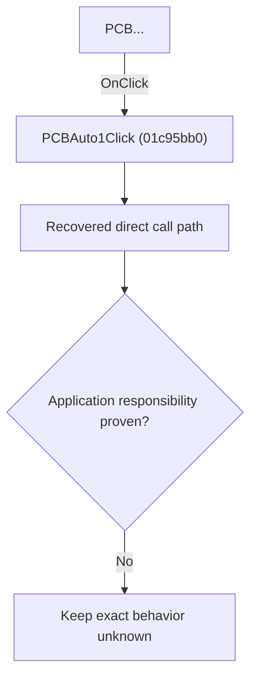

# PCB...

> Analysis status: Blocked by an exact evidence gap.

## Control

| Property | Recovered value |
| --- | --- |
| Form | SchematicEditor |
| Component path | SchematicEditor.MainMenu.mnFile.Export.PCBAuto1 |
| Control class | TMenuItem |
| Caption | PCB... |
| Hint | Not present in the recovered resource. |
| Text | Not present in the recovered resource. |
| Handler name | PCBAuto1Click |
| Handler address | 01c95bb0 |
| Graph node | `resource:dfm:SchematicEditor/SchematicEditor.MainMenu.mnFile.Export.PCBAuto1` |
| Handler node | `function:01c95bb0` |
| Graph layer | UI |

## What happens when clicked

The OnClick binding reaches PCBAuto1Click at 01c95bb0. The recovered body has 23 distinct outgoing graph call(s), but the application-specific responsibilities and data effects of its downstream path are not established in the accepted graph evidence. The control's caption or name indicates user intent only; it is not enough to claim implementation behavior.

## Click flow

## Handler evidence

- Source: [DecompiledSources/Tina16/functions/0000000001C95BB0__FUN_01c95bb0.c](../../../DecompiledSources/Tina16/functions/0000000001C95BB0__FUN_01c95bb0.c)
- Recovered role: Evidence-blocked PCBAuto1Click command.
- Current graph summary: Handles 1 Delphi UI event: SchematicEditor.MainMenu.mnFile.Export.PCBAuto1.OnClick.
- Current graph behavior: The OnClick binding reaches PCBAuto1Click at 01c95bb0. The recovered body has 23 distinct outgoing graph call(s), but the application-specific responsibilities and data effects of its downstream path are not established in the accepted graph evidence. The control's caption or name indicates user intent only; it is not enough to claim implementation behavior.
- Current graph evidence: The DFM binds SchematicEditor.MainMenu.mnFile.Export.PCBAuto1 to PCBAuto1Click. The recovered source is DecompiledSources/Tina16/functions/0000000001C95BB0__FUN_01c95bb0.c and directly references 00414480, 00414560, 00414ad0, 00414b50, 00416740, 00416ad0, 00416ba0, 00416cd0, and 15 more. No accepted end-to-end role was established for this control path.
- Complexity: complex
- Distinct outgoing calls: 23

## Direct calls

- `function:00414480` — Delphi UnicodeString clear and finalization helper
- `function:00414560` — Delphi UnicodeString array finalization helper
- `function:00414ad0` — Delphi UnicodeString assignment helper
- `function:00414b50` — FUN_00414b50
- `function:00416740` — FUN_00416740
- `function:00416ad0` — FUN_00416ad0
- `function:00416ba0` — FUN_00416ba0
- `function:00416cd0` — FUN_00416cd0
- `function:00417c40` — FUN_00417c40
- `function:0041b800` — FUN_0041b800
- `function:004414c0` — FUN_004414c0
- `function:00441640` — FUN_00441640
- `function:00441920` — FUN_00441920
- `function:00724270` — FUN_00724270
- `function:00724380` — FUN_00724380
- `function:007e2ef0` — FUN_007e2ef0
- `function:007e2f10` — FUN_007e2f10
- `function:00bac3d0` — FUN_00bac3d0
- `function:0128ee00` — FUN_0128ee00
- `function:016fd940` — FUN_016fd940
- `function:01b23030` — FUN_01b23030
- `function:01b41bc0` — FUN_01b41bc0
- `function:01bc47d0` — FUN_01bc47d0

## Resource evidence

- Kind: Not present in the recovered resource.
- Modal result: Not present in the recovered resource.
- Checked state: Not present in the recovered resource.
- List items: Not present in the recovered resource.
- Image reference: Not present in the recovered resource.
- Extracted glyph: None.

## Nearby label candidates

Nearby labels are layout candidates only. They are not proof of behavior.

- No same-parent label candidate is available.

## Analysis limits

- Exact gap: the recovered handler or one of its direct application callees lacks a source-supported role that proves the command's decisions, state changes, and output. Keep this Bead open until those callees are traced.

