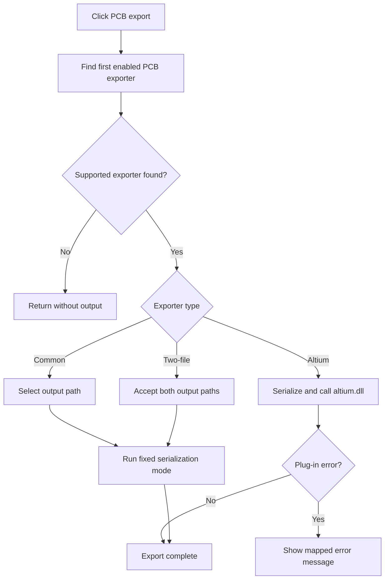

# PCB...

> Analysis status: Reviewed from the enabled-exporter, dialog, serialization-mode, and Altium plug-in paths.

## Control

| Property | Recovered value |
| --- | --- |
| Form | SchematicEditor |
| Component path | SchematicEditor.MainMenu.mnFile.Export.PCBAuto1 |
| Control class | TMenuItem |
| Caption | PCB... |
| Hint | Not present in the recovered resource. |
| Text | Not present in the recovered resource. |
| Handler name | PCBAuto1Click |
| Handler address | 01c95bb0 |
| Graph node | `resource:dfm:SchematicEditor/SchematicEditor.MainMenu.mnFile.Export.PCBAuto1` |
| Handler node | `function:01c95bb0` |
| Graph layer | UI |

## What happens when clicked

The handler scans the configured PCB exporters and uses the first enabled entry. Most entries open a Save dialog and call the common PCB serializer with a fixed export mode. The recovered mapping is exporter index 0 to mode 7, 2 to mode 1, 3 to mode 4, 4 to mode 5, 6 to mode 2, and 7 to mode 6. Index 1 creates an Altium PCB project ZIP through `altium.dll` and reports mapped plug-in errors. Index 5 collects two output paths and calls the common serializer in mode 3 only when both dialogs succeed. If no supported exporter is enabled, or a required dialog is canceled, the handler writes no output.

## Click flow

## Handler evidence

- Source: [DecompiledSources/Tina16/functions/0000000001C95BB0__FUN_01c95bb0.c](../../../DecompiledSources/Tina16/functions/0000000001C95BB0__FUN_01c95bb0.c)
- Recovered role: Dispatch the selected PCB exporter and its required output dialogs.
- Current graph summary: Handles 1 Delphi UI event: SchematicEditor.MainMenu.mnFile.Export.PCBAuto1.OnClick.
- Current graph behavior: Selects the first enabled PCB exporter, obtains its required paths, and dispatches a fixed serializer mode or the Altium PCB plug-in.
- Current graph evidence: `FUN_01c95bb0` scans the exporter list at editor offset `+0xff0`, branches on the first enabled index, and calls `FUN_01b41bc0` with modes 7, 1, 4, 5, 2, or 6 for six branches. Its index-1 branch locates `altium.dll`, serializes the active circuit, invokes the plug-in, and maps error codes. Its index-5 branch calls mode 3 only after two Save dialogs accept paths.
- Complexity: complex
- Distinct outgoing calls: 23

## Direct calls

- `function:00414480` — Delphi UnicodeString clear and finalization helper
- `function:00414560` — Delphi UnicodeString array finalization helper
- `function:00414ad0` — Delphi UnicodeString assignment helper
- `function:00414b50` — FUN_00414b50
- `function:00416740` — FUN_00416740
- `function:00416ad0` — FUN_00416ad0
- `function:00416ba0` — FUN_00416ba0
- `function:00416cd0` — FUN_00416cd0
- `function:00417c40` — FUN_00417c40
- `function:0041b800` — FUN_0041b800
- `function:004414c0` — FUN_004414c0
- `function:00441640` — FUN_00441640
- `function:00441920` — FUN_00441920
- `function:00724270` — FUN_00724270
- `function:00724380` — FUN_00724380
- `function:007e2ef0` — FUN_007e2ef0
- `function:007e2f10` — FUN_007e2f10
- `function:00bac3d0` — FUN_00bac3d0
- `function:0128ee00` — FUN_0128ee00
- `function:016fd940` — FUN_016fd940
- `function:01b23030` — FUN_01b23030
- `function:01b41bc0` — FUN_01b41bc0
- `function:01bc47d0` — FUN_01bc47d0

## Resource evidence

- Kind: Not present in the recovered resource.
- Modal result: Not present in the recovered resource.
- Checked state: Not present in the recovered resource.
- List items: Not present in the recovered resource.
- Image reference: Not present in the recovered resource.
- Extracted glyph: None.

## Nearby label candidates

Nearby labels are layout candidates only. They are not proof of behavior.

- No same-parent label candidate is available.

## Analysis limits

- The recovered exporter-list entries do not expose stable user-facing names for every index.
- Plug-in behavior after the dynamic Altium call is outside the recovered executable source.

