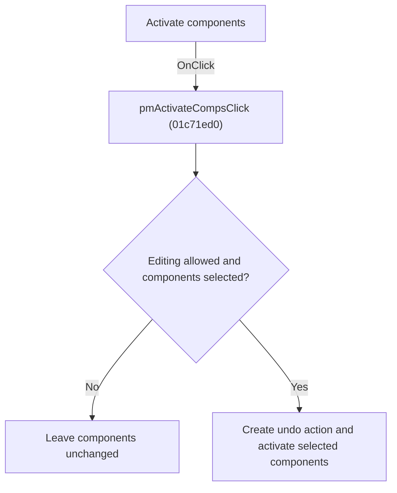

# Activate components

> Analysis status: Individually reviewed.

## Control

| Property | Recovered value |
| --- | --- |
| Form | SchematicEditor |
| Component path | SchematicEditor.SchPopup.pmActivateComps |
| Control class | TMenuItem |
| Caption | Activate components |
| Hint | Not present in the recovered resource. |
| Text | Not present in the recovered resource. |
| Handler name | pmActivateCompsClick |
| Handler address | 01c71ed0 |
| Graph node | `resource:dfm:SchematicEditor/SchematicEditor.SchPopup.pmActivateComps` |
| Handler node | `function:01c71ed0` |
| Graph layer | UI |

## What happens when clicked

If editing is allowed and selected components are available, the handler creates an undo action, activates the selected components, commits and redraws the change, and refreshes the editor. A failed permission or selection guard leaves the schematic unchanged.

## Click flow

## Handler evidence

- Source: [DecompiledSources/Tina16/functions/0000000001C71ED0__FUN_01c71ed0.c](../../../DecompiledSources/Tina16/functions/0000000001C71ED0__FUN_01c71ed0.c)
- Recovered role: Activate selected schematic components.
- Current graph summary: Handles 1 Delphi UI event: SchematicEditor.SchPopup.pmActivateComps.OnClick.
- Current graph behavior: If editing is allowed and selected components are available, the handler creates an undo action, activates the selected components, commits and redraws the change, and refreshes the editor. A failed permission or selection guard leaves the schematic unchanged.
- Current graph evidence: The recovered handler tests the shared command guard and selection state, calls the undo helper, iterates or delegates over the selected set with the activation mode, then calls commit, redraw, and refresh helpers. The popup caption is Activate components.
- Complexity: complex
- Distinct outgoing calls: 9

## Direct calls

- `function:00414480` — Delphi UnicodeString clear and finalization helper
- `function:0041ddd0` — FUN_0041ddd0
- `function:017baeb0` — FUN_017baeb0
- `function:017bb120` — FUN_017bb120
- `function:017bb400` — FUN_017bb400
- `function:01993e20` — FUN_01993e20
- `function:01994f40` — FUN_01994f40
- `function:0199e310` — FUN_0199e310
- `function:01c8cee0` — FUN_01c8cee0

## Resource evidence

- Kind: Not present in the recovered resource.
- Modal result: Not present in the recovered resource.
- Checked state: Not present in the recovered resource.
- List items: Not present in the recovered resource.
- Image reference: Not present in the recovered resource.
- Extracted glyph: None.

## Nearby label candidates

Nearby labels are layout candidates only. They are not proof of behavior.

- No same-parent label candidate is available.

## Analysis limits

- The component activation flag is recovered by use rather than by a Delphi field name.

