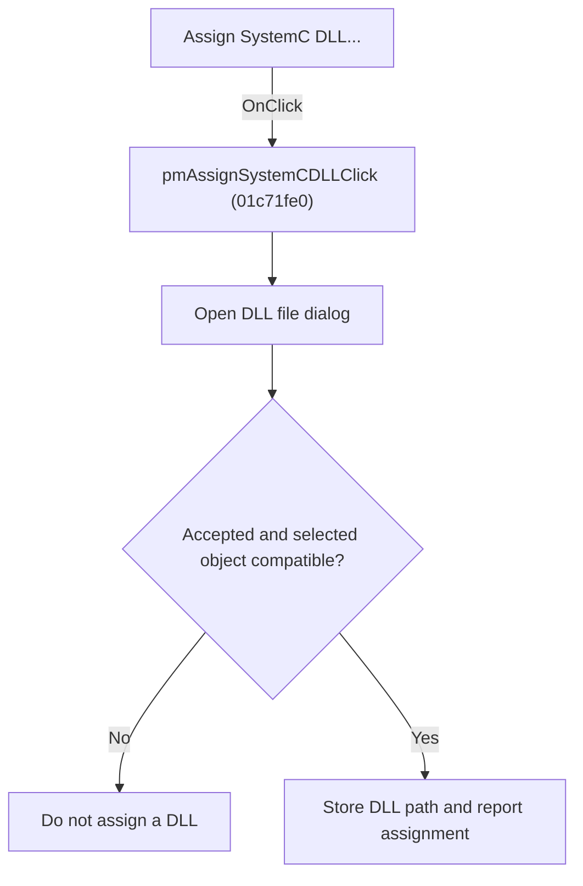

# Assign SystemC DLL...

> Analysis status: Individually reviewed.

## Control

| Property | Recovered value |
| --- | --- |
| Form | SchematicEditor |
| Component path | SchematicEditor.SchPopup.pmAssignSystemCDLL |
| Control class | TMenuItem |
| Caption | Assign SystemC DLL... |
| Hint | Not present in the recovered resource. |
| Text | Not present in the recovered resource. |
| Handler name | pmAssignSystemCDLLClick |
| Handler address | 01c71fe0 |
| Graph node | `resource:dfm:SchematicEditor/SchematicEditor.SchPopup.pmAssignSystemCDLL` |
| Handler node | `function:01c71fe0` |
| Graph layer | UI |

## What happens when clicked

The handler initializes and opens a file dialog. If the user accepts and the selected object is compatible, it assigns the chosen DLL path and reports that the SystemC DLL was assigned. Canceling the dialog or selecting an incompatible object produces no assignment.

## Click flow

## Handler evidence

- Source: [DecompiledSources/Tina16/functions/0000000001C71FE0__FUN_01c71fe0.c](../../../DecompiledSources/Tina16/functions/0000000001C71FE0__FUN_01c71fe0.c)
- Recovered role: Assign a SystemC DLL to a selected component.
- Current graph summary: Handles 1 Delphi UI event: SchematicEditor.SchPopup.pmAssignSystemCDLL.OnClick.
- Current graph behavior: The handler initializes and opens a file dialog. If the user accepts and the selected object is compatible, it assigns the chosen DLL path and reports that the SystemC DLL was assigned. Canceling the dialog or selecting an incompatible object produces no assignment.
- Current graph evidence: The recovered body configures the open-dialog fields, tests the modal result, validates the selected object's class or type, writes the selected filename into its field, and emits the literal SystemC DLL assigned. The popup caption is Assign SystemC DLL....
- Complexity: complex
- Distinct outgoing calls: 8

## Direct calls

- `function:004113f0` — FUN_004113f0
- `function:00414480` — Delphi UnicodeString clear and finalization helper
- `function:00724270` — FUN_00724270
- `function:00724420` — FUN_00724420
- `function:0072d440` — FUN_0072d440
- `function:013a9e80` — FUN_013a9e80
- `function:017741e0` — FUN_017741e0
- `function:01d3f210` — FUN_01d3f210

## Resource evidence

- Kind: Not present in the recovered resource.
- Modal result: Not present in the recovered resource.
- Checked state: Not present in the recovered resource.
- List items: Not present in the recovered resource.
- Image reference: Not present in the recovered resource.
- Extracted glyph: None.

## Nearby label candidates

Nearby labels are layout candidates only. They are not proof of behavior.

- No same-parent label candidate is available.

## Analysis limits

- The compatible component class name is not present in the recovered symbols.

