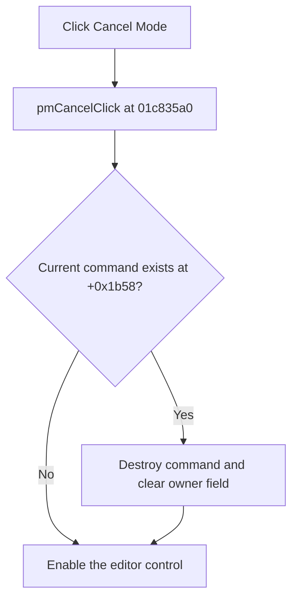

# Cancel &Mode

> Analysis status: Complete.

## Control

| Property | Recovered value |
| --- | --- |
| Form | SchematicEditor |
| Component path | SchematicEditor.SchPopup.pmCancel |
| Control class | TMenuItem |
| Caption | Cancel &Mode |
| Handler | `pmCancelClick` at `01c835a0` |
| Graph nodes | `resource:dfm:SchematicEditor/SchematicEditor.SchPopup.pmCancel` → `function:01c835a0` |
| Graph layer | UI |

## What happens when clicked

The handler delegates directly to `FUN_01c6cf20`. If the Schematic Editor owns a current interactive command at offset `+0x1b58`, that helper calls the command's virtual destructor and clears the field. It then enables the editor control at offset `+0xbd0`.

If no command exists, the click still enables the editor control. It does not show a message, retry, or run a replacement command. Neither function has a local exception block.

## Click flow

## Evidence

- Handler: [FUN_01c835a0](../../../DecompiledSources/Tina16/functions/0000000001C835A0__FUN_01c835a0.c)
- Command shutdown: [FUN_01c6cf20](../../../DecompiledSources/Tina16/functions/0000000001C6CF20__FUN_01c6cf20.c)
- Recovered role: End the current Schematic Editor command and enable the editor.
- No image or glyph is present for this pop-up item.

## Analysis limits

- The current-command field name is not recovered. Its destructor, clear, and editor-enable data flow establishes its role.
