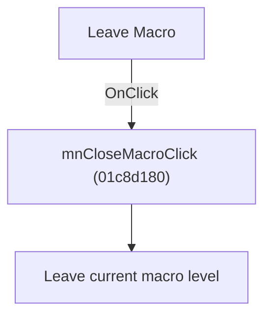

# Leave Macro

> Analysis status: Individually reviewed.

## Control

| Property | Recovered value |
| --- | --- |
| Form | SchematicEditor |
| Component path | SchematicEditor.SchPopup.pmCloseMacro |
| Control class | TMenuItem |
| Caption | Leave Macro |
| Hint | Not present in the recovered resource. |
| Text | Not present in the recovered resource. |
| Handler name | mnCloseMacroClick |
| Handler address | 01c8d180 |
| Graph node | `resource:dfm:SchematicEditor/SchematicEditor.SchPopup.pmCloseMacro` |
| Handler node | `function:01c8d180` |
| Graph layer | UI |

## What happens when clicked

The handler delegates to the macro-exit helper with index -1. Sender is unused, so the menu and popup controls leave the current macro through the same path.

## Click flow

## Handler evidence

- Source: [DecompiledSources/Tina16/functions/0000000001C8D180__FUN_01c8d180.c](../../../DecompiledSources/Tina16/functions/0000000001C8D180__FUN_01c8d180.c)
- Recovered role: Leave the current macro.
- Current graph summary: Handles 2 Delphi UI events: SchematicEditor.MainMenu.mnFile.mnCloseMacro.OnClick, SchematicEditor.SchPopup.pmCloseMacro.OnClick.
- Current graph behavior: The handler delegates to the macro-exit helper with index -1. Sender is unused, so the menu and popup controls leave the current macro through the same path.
- Current graph evidence: The recovered wrapper makes one call to the traced macro-level helper with constant -1. Two DFM captions say Leave Macro.
- Complexity: simple
- Distinct outgoing calls: 1

## Direct calls

- `function:01c8cb50` — FUN_01c8cb50

## Resource evidence

- Kind: Not present in the recovered resource.
- Modal result: Not present in the recovered resource.
- Checked state: Not present in the recovered resource.
- List items: Not present in the recovered resource.
- Image reference: Not present in the recovered resource.
- Extracted glyph: None.

## Nearby label candidates

Nearby labels are layout candidates only. They are not proof of behavior.

- No same-parent label candidate is available.

## Analysis limits

- The helper's internal save or confirmation behavior is outside this wrapper.

