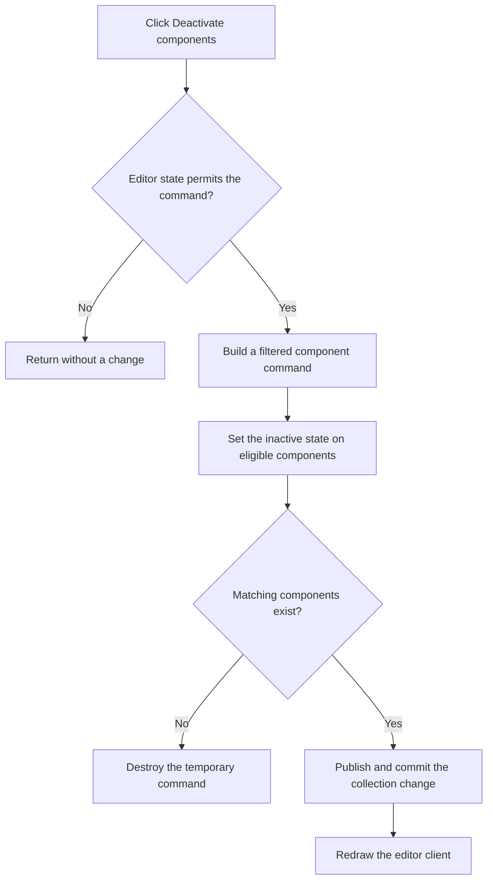

# Deactivate components

> Analysis status: Complete.

## Control

| Property | Recovered value |
| --- | --- |
| Form | SchematicEditor |
| Component path | SchematicEditor.SchPopup.pmDeactivateComps |
| Control class | TMenuItem |
| Caption | Deactivate components |
| Handler | `pmDeactivateCompsClick` at `01c8eb40` |
| Graph nodes | `resource:dfm:SchematicEditor/SchematicEditor.SchPopup.pmDeactivateComps` → `function:01c8eb40` |
| Graph layer | UI |

## What happens when clicked

The handler first calls `FUN_01c8cee0`. A nonzero result means that the current document or global editor state does not permit the command, and the click returns without a change.

When the command is permitted, the handler builds a filtered command object from the active schematic collection at `+0x27a8`. The filter keeps applicable, active component objects. `FUN_01994f40` then changes the eligible component state represented by byte `+0xac` or its nested equivalent. If the collection has no matching component, the temporary command is destroyed.

When matching components exist, the handler publishes the collection change through `FUN_0199e310`, commits the command through its virtual method, and redraws the editor client. It does not show a message or retry. It has no local exception handler.

## Click flow

## Evidence

- Handler: [FUN_01c8eb40](../../../DecompiledSources/Tina16/functions/0000000001C8EB40__FUN_01c8eb40.c)
- Command gate: [FUN_01c8cee0](../../../DecompiledSources/Tina16/functions/0000000001C8CEE0__FUN_01c8cee0.c)
- Filtered collection builder: [FUN_017bb120](../../../DecompiledSources/Tina16/functions/00000000017BB120__FUN_017bb120.c)
- State update: [FUN_01994f40](../../../DecompiledSources/Tina16/functions/0000000001994F40__FUN_01994f40.c)
- Matching-object test: [FUN_01993e20](../../../DecompiledSources/Tina16/functions/0000000001993E20__FUN_01993e20.c)
- Recovered role: Deactivate eligible components in the active schematic and commit the editor command.
- No image or glyph is present for this pop-up item.

## Analysis limits

- The Delphi names of the per-component state fields are not recovered. The filter, state write, command commit, resource caption, and redraw path establish the operation.
