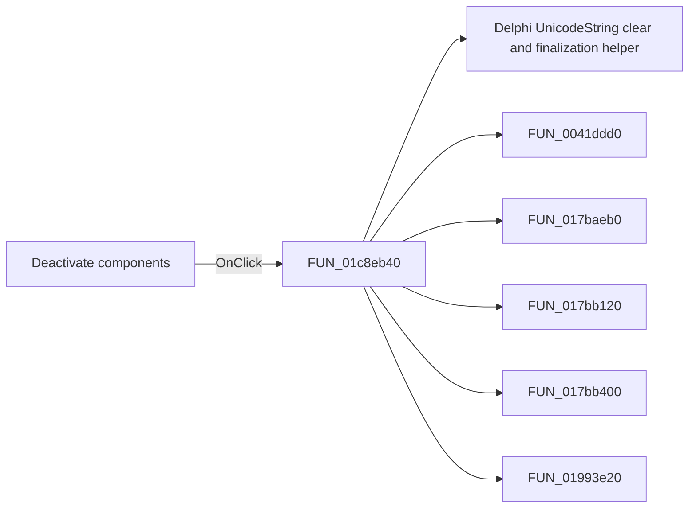

# Deactivate components

> Analysis status: Pending individual source review.

## Control

| Property | Recovered value |
| --- | --- |
| Form | SchematicEditor |
| Component path | SchematicEditor.SchPopup.pmDeactivateComps |
| Control class | TMenuItem |
| Caption | Deactivate components |
| Hint | Not present in the recovered resource. |
| Text | Not present in the recovered resource. |
| Handler name | pmDeactivateCompsClick |
| Handler address | 01c8eb40 |
| Graph node | `resource:dfm:SchematicEditor/SchematicEditor.SchPopup.pmDeactivateComps` |
| Handler node | `function:01c8eb40` |
| Graph layer | UI |

## What happens when clicked

Pending individual analysis. An agent must read the recovered handler source and its relevant callees before it replaces this text.

## Click flow

## Handler evidence

- Source: [DecompiledSources/Tina16/functions/0000000001C8EB40__FUN_01c8eb40.c](../../../DecompiledSources/Tina16/functions/0000000001C8EB40__FUN_01c8eb40.c)
- Recovered role: Not present in the recovered resource.
- Current graph summary: Handles 1 Delphi UI event: SchematicEditor.SchPopup.pmDeactivateComps.OnClick.
- Current graph behavior: Not present in the recovered resource.
- Current graph evidence: Not present in the recovered resource.
- Complexity: complex
- Distinct outgoing calls: 9

## Direct calls

- `function:00414480` — Delphi UnicodeString clear and finalization helper
- `function:0041ddd0` — FUN_0041ddd0
- `function:017baeb0` — FUN_017baeb0
- `function:017bb120` — FUN_017bb120
- `function:017bb400` — FUN_017bb400
- `function:01993e20` — FUN_01993e20
- `function:01994f40` — FUN_01994f40
- `function:0199e310` — FUN_0199e310
- `function:01c8cee0` — FUN_01c8cee0

## Resource evidence

- Kind: Not present in the recovered resource.
- Modal result: Not present in the recovered resource.
- Checked state: Not present in the recovered resource.
- List items: Not present in the recovered resource.
- Image reference: Not present in the recovered resource.
- Extracted glyph: None.

## Nearby label candidates

Nearby labels are layout candidates only. They are not proof of behavior.

- No same-parent label candidate is available.

## Analysis limits

- Do not infer behavior from the control class, caption, hint, glyph, or nearby label alone.
- Do not replace the pending status until the handler source and relevant call path provide enough evidence.
