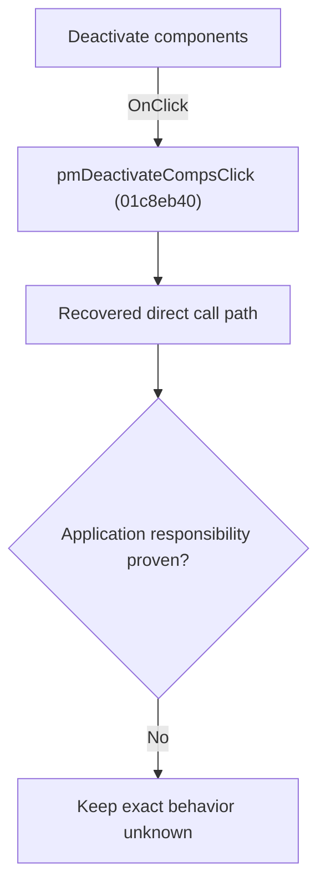

# Deactivate components

> Analysis status: Blocked by an exact evidence gap.

## Control

| Property | Recovered value |
| --- | --- |
| Form | SchematicEditor |
| Component path | SchematicEditor.SchPopup.pmDeactivateComps |
| Control class | TMenuItem |
| Caption | Deactivate components |
| Hint | Not present in the recovered resource. |
| Text | Not present in the recovered resource. |
| Handler name | pmDeactivateCompsClick |
| Handler address | 01c8eb40 |
| Graph node | `resource:dfm:SchematicEditor/SchematicEditor.SchPopup.pmDeactivateComps` |
| Handler node | `function:01c8eb40` |
| Graph layer | UI |

## What happens when clicked

The OnClick binding reaches pmDeactivateCompsClick at 01c8eb40. The recovered body has 9 distinct outgoing graph call(s), but the application-specific responsibilities and data effects of its downstream path are not established in the accepted graph evidence. The control's caption or name indicates user intent only; it is not enough to claim implementation behavior.

## Click flow

## Handler evidence

- Source: [DecompiledSources/Tina16/functions/0000000001C8EB40__FUN_01c8eb40.c](../../../DecompiledSources/Tina16/functions/0000000001C8EB40__FUN_01c8eb40.c)
- Recovered role: Evidence-blocked pmDeactivateCompsClick command.
- Current graph summary: Handles 1 Delphi UI event: SchematicEditor.SchPopup.pmDeactivateComps.OnClick.
- Current graph behavior: The OnClick binding reaches pmDeactivateCompsClick at 01c8eb40. The recovered body has 9 distinct outgoing graph call(s), but the application-specific responsibilities and data effects of its downstream path are not established in the accepted graph evidence. The control's caption or name indicates user intent only; it is not enough to claim implementation behavior.
- Current graph evidence: The DFM binds SchematicEditor.SchPopup.pmDeactivateComps to pmDeactivateCompsClick. The recovered source is DecompiledSources/Tina16/functions/0000000001C8EB40__FUN_01c8eb40.c and directly references 00414480, 0041ddd0, 017baeb0, 017bb120, 017bb400, 01993e20, 01994f40, 0199e310, and 1 more. No accepted end-to-end role was established for this control path.
- Complexity: complex
- Distinct outgoing calls: 9

## Direct calls

- `function:00414480` — Delphi UnicodeString clear and finalization helper
- `function:0041ddd0` — FUN_0041ddd0
- `function:017baeb0` — FUN_017baeb0
- `function:017bb120` — FUN_017bb120
- `function:017bb400` — FUN_017bb400
- `function:01993e20` — FUN_01993e20
- `function:01994f40` — FUN_01994f40
- `function:0199e310` — FUN_0199e310
- `function:01c8cee0` — FUN_01c8cee0

## Resource evidence

- Kind: Not present in the recovered resource.
- Modal result: Not present in the recovered resource.
- Checked state: Not present in the recovered resource.
- List items: Not present in the recovered resource.
- Image reference: Not present in the recovered resource.
- Extracted glyph: None.

## Nearby label candidates

Nearby labels are layout candidates only. They are not proof of behavior.

- No same-parent label candidate is available.

## Analysis limits

- Exact gap: the recovered handler or one of its direct application callees lacks a source-supported role that proves the command's decisions, state changes, and output. Keep this Bead open until those callees are traced.

