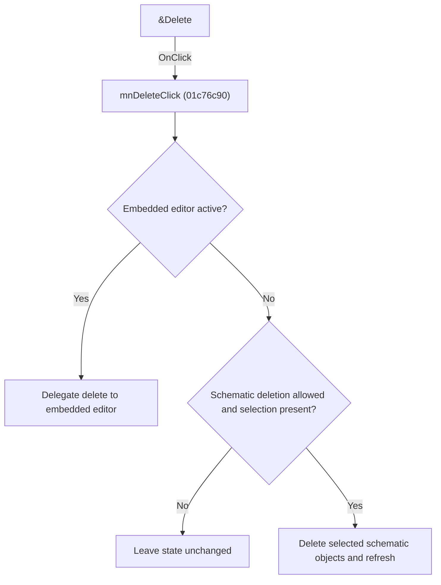

# &Delete

> Analysis status: Individually reviewed.

## Control

| Property | Recovered value |
| --- | --- |
| Form | SchematicEditor |
| Component path | SchematicEditor.SchPopup.pmDelete |
| Control class | TMenuItem |
| Caption | &Delete |
| Hint | Not present in the recovered resource. |
| Text | Not present in the recovered resource. |
| Handler name | mnDeleteClick |
| Handler address | 01c76c90 |
| Graph node | `resource:dfm:SchematicEditor/SchematicEditor.SchPopup.pmDelete` |
| Handler node | `function:01c76c90` |
| Graph layer | UI |

## What happens when clicked

The handler checks the editor mode and selection state. In the embedded editor context it delegates to that editor's delete operation. Otherwise it creates the appropriate schematic delete operation, removes selected objects, and refreshes the view. Sender only affects one localized command-text choice, so the menu, popup, and toolbar controls use the same deletion path.

## Click flow

## Handler evidence

- Source: [DecompiledSources/Tina16/functions/0000000001C76C90__FUN_01c76c90.c](../../../DecompiledSources/Tina16/functions/0000000001C76C90__FUN_01c76c90.c)
- Recovered role: Delete the current schematic or embedded-editor selection.
- Current graph summary: Handles 3 Delphi UI events: SchematicEditor.TopToolBar.EditorTools.ToolDelete.OnClick, SchematicEditor.MainMenu.Edit.mnDelete.OnClick, SchematicEditor.SchPopup.pmDelete.OnClick.
- Current graph behavior: The handler checks the editor mode and selection state. In the embedded editor context it delegates to that editor's delete operation. Otherwise it creates the appropriate schematic delete operation, removes selected objects, and refreshes the view. Sender only affects one localized command-text choice, so the menu, popup, and toolbar controls use the same deletion path.
- Current graph evidence: The recovered body contains the embedded-editor mode branch, selection and command guards, deletion and refresh calls, and one comparison of Sender against a control field for localized text. Three DFM controls share the address.
- Complexity: complex
- Distinct outgoing calls: 16

## Direct calls

- `function:00414480` — Delphi UnicodeString clear and finalization helper
- `function:0041ddd0` — FUN_0041ddd0
- `function:00b94e60` — FUN_00b94e60
- `function:00c08110` — FUN_00c08110
- `function:00f836b0` — FUN_00f836b0
- `function:017baeb0` — FUN_017baeb0
- `function:017baf00` — FUN_017baf00
- `function:017bb120` — FUN_017bb120
- `function:01993e20` — FUN_01993e20
- `function:01993ec0` — FUN_01993ec0
- `function:019946d0` — FUN_019946d0
- `function:0199e310` — FUN_0199e310
- `function:01c76c50` — FUN_01c76c50
- `function:01c87d20` — FUN_01c87d20
- `function:01c8cee0` — FUN_01c8cee0
- `function:01d3bd80` — FUN_01d3bd80

## Resource evidence

- Kind: Not present in the recovered resource.
- Modal result: Not present in the recovered resource.
- Checked state: Not present in the recovered resource.
- List items: Not present in the recovered resource.
- Image reference: Not present in the recovered resource.
- Extracted glyph: None.

## Nearby label candidates

Nearby labels are layout candidates only. They are not proof of behavior.

- No same-parent label candidate is available.

## Analysis limits

- The exact localized undo text selected by the Sender comparison is not recovered as a stable string.

