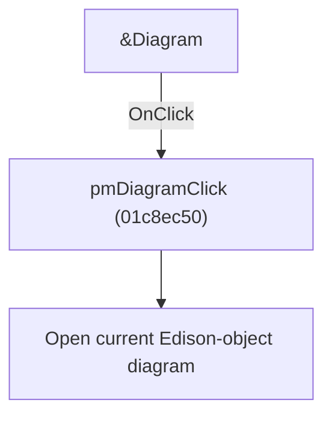

# &Diagram

> Analysis status: Individually reviewed.

## Control

| Property | Recovered value |
| --- | --- |
| Form | SchematicEditor |
| Component path | SchematicEditor.SchPopupEdison.pmEdisonDiagram |
| Control class | TMenuItem |
| Caption | &Diagram |
| Hint | Not present in the recovered resource. |
| Text | Not present in the recovered resource. |
| Handler name | pmDiagramClick |
| Handler address | 01c8ec50 |
| Graph node | `resource:dfm:SchematicEditor/SchematicEditor.SchPopupEdison.pmEdisonDiagram` |
| Handler node | `function:01c8ec50` |
| Graph layer | UI |

## What happens when clicked

The handler delegates to the current Edison object's diagram-opening method. Both popup controls share the same address and Sender is unused.

## Click flow

## Handler evidence

- Source: [DecompiledSources/Tina16/functions/0000000001C8EC50__FUN_01c8ec50.c](../../../DecompiledSources/Tina16/functions/0000000001C8EC50__FUN_01c8ec50.c)
- Recovered role: Open the diagram for the current Edison object.
- Current graph summary: Handles 2 Delphi UI events: SchematicEditor.SchPopup.pmDiagram.OnClick, SchematicEditor.SchPopupEdison.pmEdisonDiagram.OnClick.
- Current graph behavior: The handler delegates to the current Edison object's diagram-opening method. Both popup controls share the same address and Sender is unused.
- Current graph evidence: The recovered body makes one virtual call through the current Edison-object field. The two DFM bindings have Diagram captions.
- Complexity: simple
- Distinct outgoing calls: 1

## Direct calls

- `function:013e1380` — FUN_013e1380

## Resource evidence

- Kind: Not present in the recovered resource.
- Modal result: Not present in the recovered resource.
- Checked state: Not present in the recovered resource.
- List items: Not present in the recovered resource.
- Image reference: Not present in the recovered resource.
- Extracted glyph: None.

## Nearby label candidates

Nearby labels are layout candidates only. They are not proof of behavior.

- No same-parent label candidate is available.

## Analysis limits

- The diagram object's Delphi class name is not recovered.

