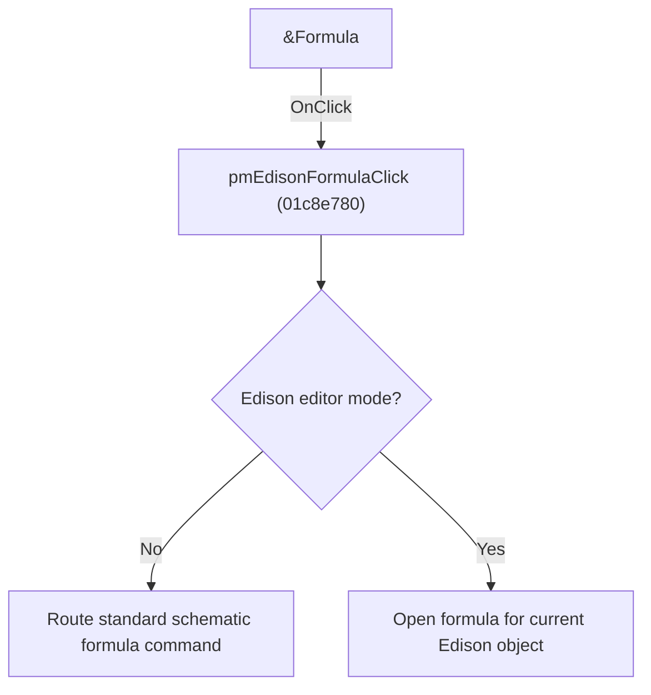

# &Formula

> Analysis status: Individually reviewed.

## Control

| Property | Recovered value |
| --- | --- |
| Form | SchematicEditor |
| Component path | SchematicEditor.SchPopupEdison.pmEdisonFormula |
| Control class | TMenuItem |
| Caption | &Formula |
| Hint | Not present in the recovered resource. |
| Text | Not present in the recovered resource. |
| Handler name | pmEdisonFormulaClick |
| Handler address | 01c8e780 |
| Graph node | `resource:dfm:SchematicEditor/SchematicEditor.SchPopupEdison.pmEdisonFormula` |
| Handler node | `function:01c8e780` |
| Graph layer | UI |

## What happens when clicked

In normal schematic mode the handler routes the formula command through the standard command wrapper. In Edison mode it opens the formula editor for the current Edison object. The two popup controls therefore use the branch that matches their editor context.

## Click flow

## Handler evidence

- Source: [DecompiledSources/Tina16/functions/0000000001C8E780__FUN_01c8e780.c](../../../DecompiledSources/Tina16/functions/0000000001C8E780__FUN_01c8e780.c)
- Recovered role: Open the applicable formula editor.
- Current graph summary: Handles 2 Delphi UI events: SchematicEditor.SchPopup.pmFormula.OnClick, SchematicEditor.SchPopupEdison.pmEdisonFormula.OnClick.
- Current graph behavior: In normal schematic mode the handler routes the formula command through the standard command wrapper. In Edison mode it opens the formula editor for the current Edison object. The two popup controls therefore use the branch that matches their editor context.
- Current graph evidence: The recovered body tests the editor-mode field, calls a normal-mode command helper in one branch, and calls the Edison-object formula helper in the other. The DFM binds Formula items from both popup menus.
- Complexity: complex
- Distinct outgoing calls: 3

## Direct calls

- `function:00f836b0` — FUN_00f836b0
- `function:0145f5e0` — FUN_0145f5e0
- `function:01c87d20` — FUN_01c87d20

## Resource evidence

- Kind: Not present in the recovered resource.
- Modal result: Not present in the recovered resource.
- Checked state: Not present in the recovered resource.
- List items: Not present in the recovered resource.
- Image reference: Not present in the recovered resource.
- Extracted glyph: None.

## Nearby label candidates

Nearby labels are layout candidates only. They are not proof of behavior.

- No same-parent label candidate is available.

## Analysis limits

- The normal-mode wrapper's downstream formula object types are not enumerated here.

