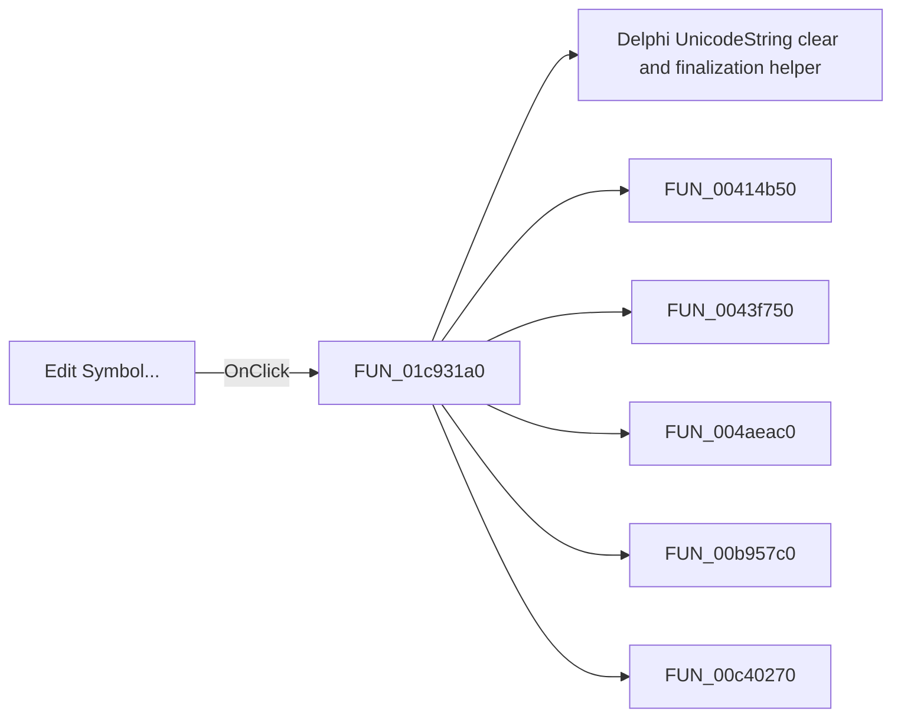

# Edit Symbol...

> Analysis status: Pending individual source review.

## Control

| Property | Recovered value |
| --- | --- |
| Form | SchematicEditor |
| Component path | SchematicEditor.SchPopup.pmEditSymbol |
| Control class | TMenuItem |
| Caption | Edit Symbol... |
| Hint | Not present in the recovered resource. |
| Text | Not present in the recovered resource. |
| Handler name | mnEditSymbolClick |
| Handler address | 01c931a0 |
| Graph node | `resource:dfm:SchematicEditor/SchematicEditor.SchPopup.pmEditSymbol` |
| Handler node | `function:01c931a0` |
| Graph layer | UI |

## What happens when clicked

Pending individual analysis. An agent must read the recovered handler source and its relevant callees before it replaces this text.

## Click flow

## Handler evidence

- Source: [DecompiledSources/Tina16/functions/0000000001C931A0__FUN_01c931a0.c](../../../DecompiledSources/Tina16/functions/0000000001C931A0__FUN_01c931a0.c)
- Recovered role: Not present in the recovered resource.
- Current graph summary: Handles 2 Delphi UI events: SchematicEditor.MainMenu.Edit.mnEditSymbol.OnClick, SchematicEditor.SchPopup.pmEditSymbol.OnClick.
- Current graph behavior: Not present in the recovered resource.
- Current graph evidence: Not present in the recovered resource.
- Complexity: complex
- Distinct outgoing calls: 18

## Direct calls

- `function:00414480` — Delphi UnicodeString clear and finalization helper
- `function:00414b50` — FUN_00414b50
- `function:0043f750` — FUN_0043f750
- `function:004aeac0` — FUN_004aeac0
- `function:00b957c0` — FUN_00b957c0
- `function:00c40270` — FUN_00c40270
- `function:00c40790` — FUN_00c40790
- `function:00c41060` — FUN_00c41060
- `function:01768da0` — FUN_01768da0
- `function:01768e50` — FUN_01768e50
- `function:0198a580` — FUN_0198a580
- `function:0198d430` — FUN_0198d430
- `function:01993ec0` — FUN_01993ec0
- `function:01c8cee0` — FUN_01c8cee0
- `function:01c92b70` — FUN_01c92b70
- `function:01d01990` — FUN_01d01990
- `function:01d01aa0` — FUN_01d01aa0
- `function:01d04d40` — FUN_01d04d40

## Resource evidence

- Kind: Not present in the recovered resource.
- Modal result: Not present in the recovered resource.
- Checked state: Not present in the recovered resource.
- List items: Not present in the recovered resource.
- Image reference: Not present in the recovered resource.
- Extracted glyph: None.

## Nearby label candidates

Nearby labels are layout candidates only. They are not proof of behavior.

- No same-parent label candidate is available.

## Analysis limits

- Do not infer behavior from the control class, caption, hint, glyph, or nearby label alone.
- Do not replace the pending status until the handler source and relevant call path provide enough evidence.
