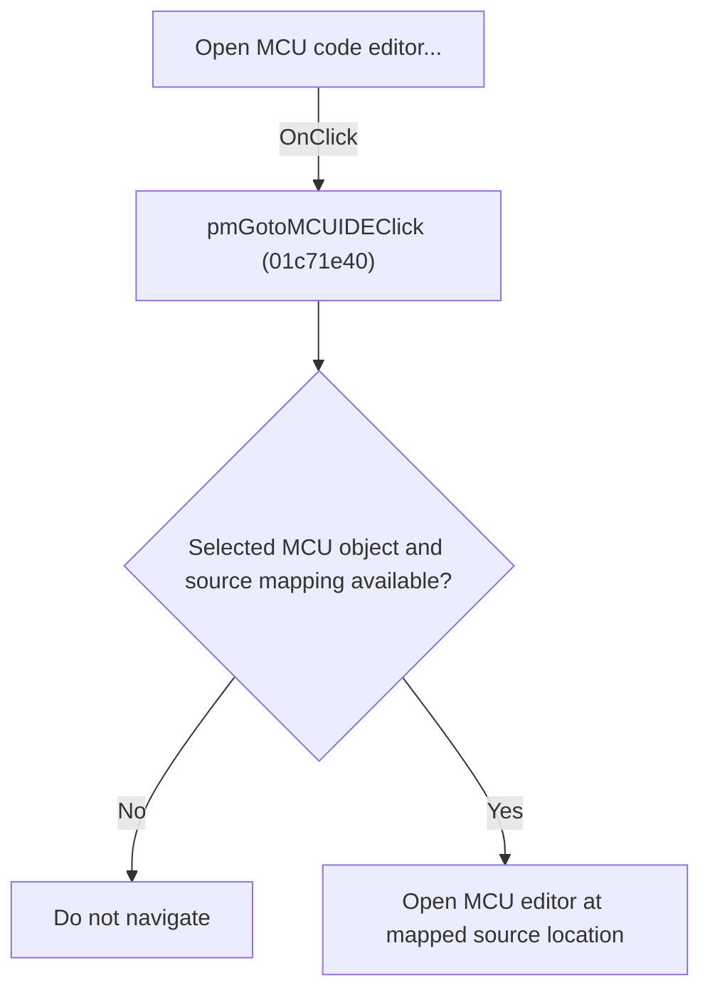

# Open MCU code editor...

> Analysis status: Individually reviewed.

## Control

| Property | Recovered value |
| --- | --- |
| Form | SchematicEditor |
| Component path | SchematicEditor.SchPopup.pmGotoMCUIDE |
| Control class | TMenuItem |
| Caption | Open MCU code editor... |
| Hint | Not present in the recovered resource. |
| Text | Not present in the recovered resource. |
| Handler name | pmGotoMCUIDEClick |
| Handler address | 01c71e40 |
| Graph node | `resource:dfm:SchematicEditor/SchematicEditor.SchPopup.pmGotoMCUIDE` |
| Handler node | `function:01c71e40` |
| Graph layer | UI |

## What happens when clicked

The handler obtains the selected MCU object, builds its session and source mapping, resolves the schematic item to a source location, and opens the MCU code editor at that recovered position. If the required object or mapping is unavailable, no editor navigation occurs.

## Click flow

## Handler evidence

- Source: [DecompiledSources/Tina16/functions/0000000001C71E40__FUN_01c71e40.c](../../../DecompiledSources/Tina16/functions/0000000001C71E40__FUN_01c71e40.c)
- Recovered role: Open the selected MCU source location.
- Current graph summary: Handles 1 Delphi UI event: SchematicEditor.SchPopup.pmGotoMCUIDE.OnClick.
- Current graph behavior: The handler obtains the selected MCU object, builds its session and source mapping, resolves the schematic item to a source location, and opens the MCU code editor at that recovered position. If the required object or mapping is unavailable, no editor navigation occurs.
- Current graph evidence: The recovered body follows the selected-object pointer through MCU-specific helpers, builds a path value, maps a source position, and calls the MCU editor-opening helper. The popup resource caption is Open MCU code editor....
- Complexity: complex
- Distinct outgoing calls: 4

## Direct calls

- `function:00414480` — Delphi UnicodeString clear and finalization helper
- `function:015f5c70` — FUN_015f5c70
- `function:015fca00` — FUN_015fca00
- `function:0160f2b0` — FUN_0160f2b0

## Resource evidence

- Kind: Not present in the recovered resource.
- Modal result: Not present in the recovered resource.
- Checked state: Not present in the recovered resource.
- List items: Not present in the recovered resource.
- Image reference: Not present in the recovered resource.
- Extracted glyph: None.

## Nearby label candidates

Nearby labels are layout candidates only. They are not proof of behavior.

- No same-parent label candidate is available.

## Analysis limits

- The recovered source does not name the MCU session and mapping record types.

