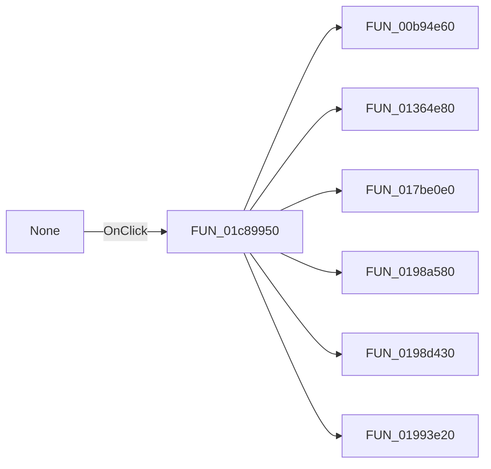

# None

> Analysis status: Pending individual source review.

## Control

| Property | Recovered value |
| --- | --- |
| Form | SchematicEditor |
| Component path | SchematicEditor.PopupPower.pmPwrNone |
| Control class | TMenuItem |
| Caption | None |
| Hint | Not present in the recovered resource. |
| Text | Not present in the recovered resource. |
| Handler name | pmPowerClick |
| Handler address | 01c89950 |
| Graph node | `resource:dfm:SchematicEditor/SchematicEditor.PopupPower.pmPwrNone` |
| Handler node | `function:01c89950` |
| Graph layer | UI |

## What happens when clicked

Pending individual analysis. An agent must read the recovered handler source and its relevant callees before it replaces this text.

## Click flow

## Handler evidence

- Source: [DecompiledSources/Tina16/functions/0000000001C89950__FUN_01c89950.c](../../../DecompiledSources/Tina16/functions/0000000001C89950__FUN_01c89950.c)
- Recovered role: Not present in the recovered resource.
- Current graph summary: Handles 4 Delphi UI events: SchematicEditor.PopupPower.pmPwrNone.OnClick, SchematicEditor.PopupPower.pmPwrSource.OnClick, SchematicEditor.PopupPower.pmPwrSink.OnClick.
- Current graph behavior: Not present in the recovered resource.
- Current graph evidence: Not present in the recovered resource.
- Complexity: complex
- Distinct outgoing calls: 8

## Direct calls

- `function:00b94e60` — FUN_00b94e60
- `function:01364e80` — FUN_01364e80
- `function:017be0e0` — FUN_017be0e0
- `function:0198a580` — FUN_0198a580
- `function:0198d430` — FUN_0198d430
- `function:01993e20` — FUN_01993e20
- `function:0199e310` — FUN_0199e310
- `function:01c6cee0` — FUN_01c6cee0

## Resource evidence

- Kind: Not present in the recovered resource.
- Modal result: Not present in the recovered resource.
- Checked state: Not present in the recovered resource.
- List items: Not present in the recovered resource.
- Image reference: Not present in the recovered resource.
- Extracted glyph: None.

## Nearby label candidates

Nearby labels are layout candidates only. They are not proof of behavior.

- No same-parent label candidate is available.

## Analysis limits

- Do not infer behavior from the control class, caption, hint, glyph, or nearby label alone.
- Do not replace the pending status until the handler source and relevant call path provide enough evidence.
