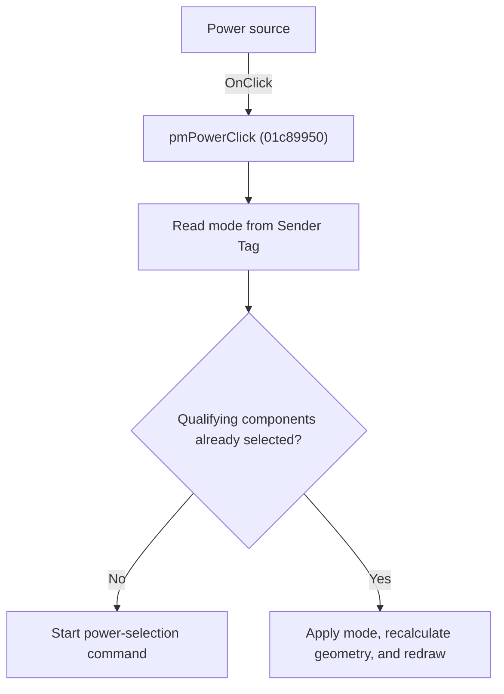

# Power source

> Analysis status: Individually reviewed.

## Control

| Property | Recovered value |
| --- | --- |
| Form | SchematicEditor |
| Component path | SchematicEditor.PopupPower.pmPwrSource |
| Control class | TMenuItem |
| Caption | Power source |
| Hint | Not present in the recovered resource. |
| Text | Not present in the recovered resource. |
| Handler name | pmPowerClick |
| Handler address | 01c89950 |
| Graph node | `resource:dfm:SchematicEditor/SchematicEditor.PopupPower.pmPwrSource` |
| Handler node | `function:01c89950` |
| Graph layer | UI |

## What happens when clicked

The handler reads the clicked item's Tag. Depending on current selection state, it either starts a power-selection command or applies that mode to qualifying selected components, recalculates their geometry, and redraws. The four controls select None, Power loss, Power sink, or Power source by their resource identity.

## Click flow

## Handler evidence

- Source: [DecompiledSources/Tina16/functions/0000000001C89950__FUN_01c89950.c](../../../DecompiledSources/Tina16/functions/0000000001C89950__FUN_01c89950.c)
- Recovered role: Select or apply an interactive power mode.
- Current graph summary: Handles 4 Delphi UI events: SchematicEditor.PopupPower.pmPwrNone.OnClick, SchematicEditor.PopupPower.pmPwrSource.OnClick, SchematicEditor.PopupPower.pmPwrSink.OnClick.
- Current graph behavior: The handler reads the clicked item's Tag. Depending on current selection state, it either starts a power-selection command or applies that mode to qualifying selected components, recalculates their geometry, and redraws. The four controls select None, Power loss, Power sink, or Power source by their resource identity.
- Current graph evidence: The recovered body reads Sender offset 0x18, branches on selection state, constructs a command in one branch, and in the other writes the mode to qualifying objects before geometry and redraw calls. Four captioned popup items share the address.
- Complexity: complex
- Distinct outgoing calls: 8

## Direct calls

- `function:00b94e60` — FUN_00b94e60
- `function:01364e80` — FUN_01364e80
- `function:017be0e0` — FUN_017be0e0
- `function:0198a580` — FUN_0198a580
- `function:0198d430` — FUN_0198d430
- `function:01993e20` — FUN_01993e20
- `function:0199e310` — FUN_0199e310
- `function:01c6cee0` — FUN_01c6cee0

## Resource evidence

- Kind: Not present in the recovered resource.
- Modal result: Not present in the recovered resource.
- Checked state: Not present in the recovered resource.
- List items: Not present in the recovered resource.
- Image reference: Not present in the recovered resource.
- Extracted glyph: None.

## Nearby label candidates

Nearby labels are layout candidates only. They are not proof of behavior.

- No same-parent label candidate is available.

## Analysis limits

- The checked-in UI evidence omits the numeric Tag assigned to each named mode.

