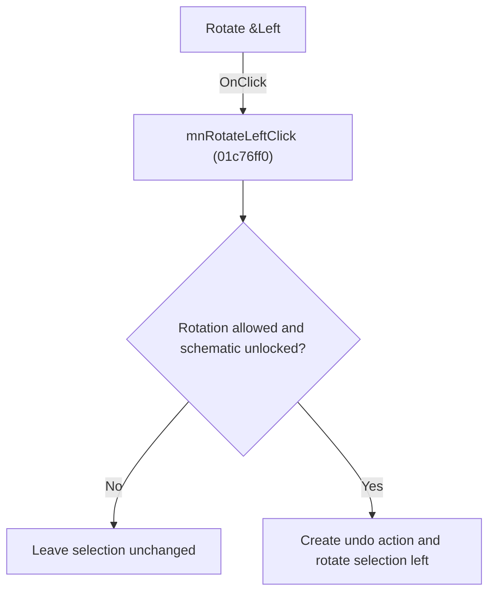

# Rotate &Left

> Analysis status: Individually reviewed.

## Control

| Property | Recovered value |
| --- | --- |
| Form | SchematicEditor |
| Component path | SchematicEditor.SchPopup.pmRotateLeft |
| Control class | TMenuItem |
| Caption | Rotate &Left |
| Hint | Not present in the recovered resource. |
| Text | Not present in the recovered resource. |
| Handler name | mnRotateLeftClick |
| Handler address | 01c76ff0 |
| Graph node | `resource:dfm:SchematicEditor/SchematicEditor.SchPopup.pmRotateLeft` |
| Handler node | `function:01c76ff0` |
| Graph layer | UI |

## What happens when clicked

The handler forwards the click to the traced rotate-left operation used by the toolbar. Sender is unused, so the menu and popup controls behave identically.

## Click flow

## Handler evidence

- Source: [DecompiledSources/Tina16/functions/0000000001C76FF0__FUN_01c76ff0.c](../../../DecompiledSources/Tina16/functions/0000000001C76FF0__FUN_01c76ff0.c)
- Recovered role: Rotate selected schematic objects left.
- Current graph summary: Handles 2 Delphi UI events: SchematicEditor.MainMenu.Edit.mnRotateLeft.OnClick, SchematicEditor.SchPopup.pmRotateLeft.OnClick.
- Current graph behavior: The handler forwards the click to the traced rotate-left operation used by the toolbar. Sender is unused, so the menu and popup controls behave identically.
- Current graph evidence: The recovered body is a single call to FUN_01c6d1a0, whose permission, undo, transform, redraw, and result paths were inspected.
- Complexity: simple
- Distinct outgoing calls: 1

## Direct calls

- `function:01c6d1a0` — FUN_01c6d1a0

## Resource evidence

- Kind: Not present in the recovered resource.
- Modal result: Not present in the recovered resource.
- Checked state: Not present in the recovered resource.
- List items: Not present in the recovered resource.
- Image reference: Not present in the recovered resource.
- Extracted glyph: None.

## Nearby label candidates

Nearby labels are layout candidates only. They are not proof of behavior.

- No same-parent label candidate is available.

## Analysis limits

- No control-specific branch exists in this wrapper.

